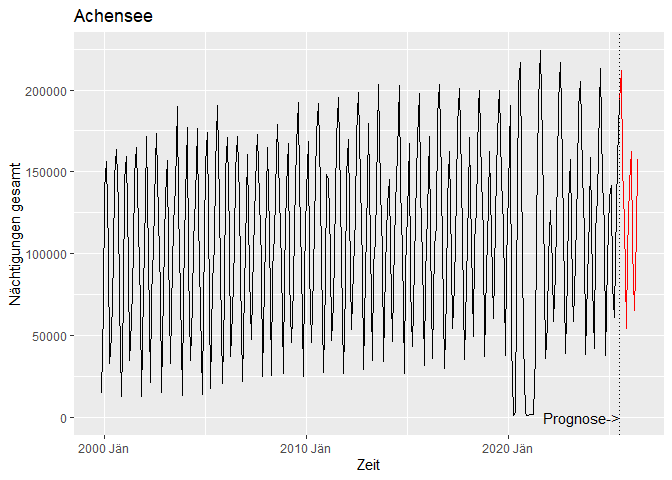
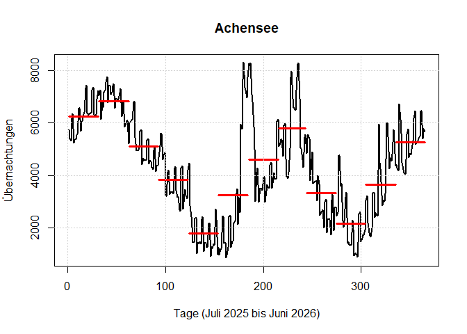

Dokumentation Nächtigungsvorschau
================
Nicholas Katz – JR POLICIES, Karsten Reichold – TU Wien, Martin Wagner –
AAU
25.08.2025

------------------------------------------------------------------------

## Einleitung

Das Modell erstellt eine *Nächtigungsprognose für Hotels und
Ferienwohnungen in österreichischen Tourismusregionen*. Diese erfolgt
auf Monats- und Tagesbasis. Unter Verwendung von kalendarischen
Informationen wurden mithilfe eines Random-Forest-Modells
Monatsprognosen erstellt. Mit Mobilfunkdaten und einer adaptiven
LASSO-Regression wurde die Monatsprognose auf tägliche Daten
disaggregiert. Das Modell wurde von einem Team von Joanneum Research,
der TU Wien und der AAU in R implementiert und wird mit Unterstützung
der Österreich Werbung frei zur verfügung gestellt.

## Projektstruktur

In diesem Repository dient das ReadMe File als Code-Dokumentation, Daten
werden in einem getrennten Ordner dargestellt.

### Dokumentation der Methoden

In diesem File ist die methodische Vorgehensweise zusammengefasst. Als
Defaultregion wurde die Region Achensee ausgewählt. Das Skript startet
mit den wichtigsten Initialisierungen, Hilfsfunktionen und Vorarbeiten,
umfasst die Prozedur für die Erstellung der Monatsprognose und
anschließend die Disaggregation auf tägliche Nächtigungen.

### Daten

Im Ordner Daten befinden sich zusammengefasste monatliche Nächtigungen
in Hotels und Ferienwohnungen von Statistik Austria, kalendarische Daten
und Daten zu Events für Random Forest und Disaggregation, die
empfohlenen Modellparameter pro Prognoseregion aus einem umfangreichen
Gridsearch sowie pseudonymisierte tägliche Nächtigungsdaten für die
Jahre 2022, 2023 und 2024. Diese Daten wurden aus einer
Linearkombination aus ausgewählten Daten von Feratel und Mobilfunkdaten
von Drei und A1/Invenium erstellt und können für dieses Projekt oder
eigene Anwendungen mit Verweis auf dieses Projekt und die Österreich
Werbung frei verwendet werden.

## Genutzte Pakete und Hilfsfunktionen

Für die Vorgehensweise wurden unterschiedliche Pakete genutzt. `ggplot2`
ist ein Standardpaket zur Datenvisualisierung, `forecast` ist eine
Prognosetoolbox für Zeitreihendaten. Das Paket `data.table` hilft bei
der schnellen Bearbeitung von großen Datensätzen (Aggregation, Joins,
Modifikationen).`randomForest` inkludiert die Implementierung von Random
Forests nach Breiman (2001). `tsutils` ist eine Toolbox zur
Visualisierung, Dekomposition und Modellierung von Zeitreihen. `fpp3`
ist die Kollektion von Funktionalitäten von Hyndman und Athanasopoulos,
die in “Forecasting: Principles and Practice” (3rd Edition) Erwähnung
finden. `rangerts` ist eine neuere Modellspezifikation von Random
Forests, die ein “Block Bootstrapping” (Zeitabhängigkeiten der Daten)
implementiert – eine Dokumentation ist hier zu finden:
<https://github.com/hyanworkspace/rangerts?tab=readme-ov-file>. Das
Paket `dplyr` umfasst viele “Quality-of-Life”-Funktionen zum
Datenmanagement und Data Wrangling. Auch das Package `lubridate` umfasst
einige Funktionalitäten, um das Arbeiten mit Datum und Uhrzeiten zu
erleichtern. Das Paket `stringr` liefert viele Hilfsfunktionen für den
Umgang mit Textdaten (Strings). Das Paket `glmnet` ist ein Paket zur
Verwendung von fortgeschrittenen statistischen Modellen, das hier für
die Tagesdisaggregation mittels adaptiver LASSO genutzt wird.

``` r
################################################################
################## packages ####################################
################################################################
library(ggplot2)
library(forecast)
library(fpp3)
library(data.table)
library(randomForest) # for randomForest()
library(tsutils) # for lagmatrix()
library(zoo)

# for random forest with moving block bootstrap:
library(rangerts) # https://github.com/hyanworkspace/rangerts # quiet = TRUE to mask c++ compilation messages, optional # devtools::install_github("hyanworkspace/rangerts", quiet = TRUE)
library(dplyr)

library(lubridate)
library(stringr)
library(glmnet)
```

## Dateninitialisierung

Die gewünschte Region wird ausgewählt (`i` entspricht dabei dem Index
der Positionierung im Regionsvektor) und der Prognosezeitraum wird auf
zwölf Monate festgelegt.

``` r
# Select Region
i = 1 # e.g. i=1 corresponds to region = "Achensee"


# forecasting horizon (in months):
H <- 12
```

Im nächsten Schritt wurden die Rohdaten, Ferien und Feiertage sowie
Events und Konzerte geladen.

``` r
################################################################
################## data preprocessing ##########################
################################################################

# read whole data set (saved as .csv file):
data <- read.csv2("./data/monthly_stays.csv")


# read additional data file containing holidays (saved as .csv file):
holidays <- read.csv2("./data/Ferien_und_Feiertage.csv")

daily_events_s <- read.csv2("./data/Events_Konzerte_daily_K.csv")
daily_events_s[is.na(daily_events_s)] <- ""
daily_events_s[,-1][daily_events_s[-1]!=""] <- 1
daily_events_s[,-1][daily_events_s[-1]==""] <- 0
daily_events_m <- read.csv2("./data/Events_Konzerte_daily_M.csv")
daily_events_m[is.na(daily_events_m)] <- ""
daily_events_m[,-1][daily_events_m[-1]!=""] <- 1
daily_events_m[,-1][daily_events_m[-1]==""] <- 0
daily_events_l <- read.csv2("./data/Events_Konzerte_daily_G.csv")
daily_events_l[is.na(daily_events_l)] <- ""
daily_events_l[,-1][daily_events_l[-1]!=""] <- 1
daily_events_l[,-1][daily_events_l[-1]==""] <- 0

dummy_ostern <- holidays$Ostersonntag
dummy_pfingsten <- holidays$Pfingsten
dummy_feiertage_AT <- holidays$`Freie Tage Österreich`
dummy_feiertage_DE <- holidays$`Freie Tage Deutschland`
dummy_feiertage_Rest <- holidays$`Freie Tage Rest`
dummy_fronleichnam <- holidays$Fronleichnam
dummy_winterbayern <- holidays$winterferien_bayern
dummy_herbstferien <- holidays$Herbstferien
dummy_schaltjahr <- holidays$Schaltjahr
holidays$unique_months <- as.factor(holidays$unique_months)
easter_pos <- as.factor(holidays$easter_pos)
dummy_eastermarch <- holidays$oster_maerz %>% as.factor()
dummy_noeasterapril <- holidays$kein_ostern_april %>% as.factor()

# get events for specific region
eventframe <- read.csv2("./data/Events_Konzerte_monatlich.csv")
eventframe[is.na(eventframe)] <- 0
eventframe <- eventframe[,i+3]
```

Auch Hilfstabellen wurden erstellt, um die Ergebnisse der folgenden
Auswertungen automatisiert abspeichern zu können. Für alle Regionen
wurde ein umfangreicher Gridsearch durchgeführt, um die ideale
Kombination aus Parametern für die Modelle auszuwählen – diese werden
hier automatisch für die Region ausgelesen. Nach derzeitigem Stand wird
die optimale Variante nach RMSE gewählt.

``` r
# create vector of regions:
region_vec <- data$Region[seq(1,428,by=4)] # 107 regions (100 regular and 7 federal state rest regions), 4 categories

# create outputmatrix
outputmatrix <- matrix(NaN, nrow = 308,ncol=length(region_vec))
outputmatrix <- outputmatrix %>% as.data.frame()
colnames(outputmatrix) <- region_vec

daily_output_matrix <- matrix(NaN, nrow=365,ncol = length(region_vec)) %>% as.data.frame()
colnames(daily_output_matrix) <- region_vec


# load the best parameterization based on extensive gridsearch
region <- region_vec[i]
method_sample <- read.csv2("./data/region_method_rmse.csv") 
  usemethod <- method_sample[,3][method_sample$region_vec == region]
  sample <- method_sample[,4][method_sample$region_vec == region]
  fwindow <- method_sample[,5][method_sample$region_vec == region]
  block <- method_sample[,6][method_sample$region_vec == region]
  lagvar <- method_sample[,7][method_sample$region_vec == region]
  swindow <- method_sample[,8][method_sample$region_vec == region]
  trendmin <- method_sample[,10][method_sample$region_vec == region]
```

## Vorarbeiten

In einem nächsten Schritt werden die Daten eingelesen. Daraufhin werden
die Daten in einen speziellen Zeitreihentyp transformiert, um damit für
die weitere Analyse besser arbeiten zu können.

``` r
# get data
data_region_gesamt <- data |>
  filter(Region == region) |>
  group_by(`Saison.Tourismusmonat`)

# create date vector in required format:
data_region_gesamt$Monat = yearmonth(seq(as.Date("1999-11-01"), as.Date("2025-06-01"), by = "1 month")) #%>% rep(each=2)

data_region_gesamt <- data_region_gesamt %>% group_by(Monat) %>% summarise(Anzahl = sum(Ergebnis))


# create time series data frame:
region_gesamt <- tsibble(Monat = data_region_gesamt$Monat, Anzahl = as.numeric(data_region_gesamt$Anzahl), index = Monat)
```

Für die Evaluierung wurden die Daten in einen Trainings- und einen
Testdatensatz unterteilt – diese Notwendigkeit entfällt bei der
Out-of-Sample-Prognose.

``` r
  # consider the whole sample period:
  region_gesamt_total <- region_gesamt[1:308,] 
  region_gesamt_training <- region_gesamt[1:296,] 
  region_gesamt_test <- region_gesamt[297:308,] 
  x_covid_training <- c(rep(0, 242),rep(1,24),rep(0,24)) # Covid period in the training sample: 01/2020 - 12/2021 (2 years)
```

Das volle Sample der Nächtigungen reicht von November 1999 bis heute.

``` r
  dummy_ostern <- holidays$Ostersonntag %>% as.factor()
  dummy_pfingsten <- holidays$Pfingsten %>% as.factor()
  dummy_feiertage_AT <- holidays$`Freie Tage Österreich`
  dummy_feiertage_DE <- holidays$`Freie Tage Deutschland`
  dummy_feiertage_Rest <- holidays$`Freie Tage Rest`
  dummy_fronleichnam <- holidays$Fronleichnam %>% as.factor()
  dummy_winterbayern <- holidays$winterferien_bayern %>% as.factor()
  dummy_herbstferien <- holidays$Herbstferien %>% as.factor()
  #dummy_event_s <- eventframe_s
  #dummy_event_m <- eventframe_m
  dummy_event_l <- eventframe_l %>% as.factor()
  dummy_schaltjahr <- holidays$Schaltjahr %>% as.factor()
  bridge_days_weighted <- holidays$bridge_days_weighted
  unique_months<- holidays$unique_months %>% as.factor()
  weights<- holidays$weights
  fourier_term <- holidays$fourier
  jahr <- holidays$Jahr
  easter_pos <- holidays$easter_pos %>% as.factor()
  dummy_eastermarch <- holidays$oster_maerz %>% as.factor()
  dummy_noeasterapril <- holidays$kein_ostern_april %>% as.factor()
  
  x_earlyperiod <- c(rep(1, 120),rep(0,8000)) %>% as.factor()
  x_covid <- c(rep(0, 242),rep(1,24),rep(0,8000))  %>% as.factor()# Covid period 01/2020 - 12/2021 (2 years)
  x_postcov <- c(rep(0, 242),rep(0,24),rep(1,12),rep(0,8000))  %>% as.factor()# Covid recovery period 01/2022 - 12/2022 (1 year)
  
  training_set <- region_gesamt[1:308,]#[1:290,]
  # forecast
  dummy_monat <- c(11:12,rep(1:12,28))
  
}  
```

## Prognosen

Für die Monatsprognose wurden zwei leicht unterschiedliche Modelle definiert.
Einerseits wurde ein klassischer Random Forest nach Breiman (2001)
betrachtet, andererseits wurde eine Spezifikation gewählt, die das
Bootstrapping der Methode modifiziert, um die serielle Korrelation der
Zeitreihe besser abzufangen. Diese beiden Verfahren wurden dann unter
Verwendung von STL (Saison-Trend-Dekomposition
mittels Loess) nach Cleveland et al. (1990) trendbereinigt. Beim
diesem Ansatz wird der Trend separat über exponentielle Glättung
vorhergesagt, während der Random Forest die verbliebene Zeitreihe
vorhersagt – die beiden Komponenten werden anschließend zur Prognose
zusammengeführt.

Neben den offiziellen Nächtigungsstatistiken und kalendarischen Effekten
spielen auch Verzögerungsterme (lags) der Zeitreihe und ihrer
Komponenten eine Rolle für die Prognose.

Die nachfolgende Abbildung zeigt beispielhaft zwei der 2.500 erstellten
Regressionsbäume des Random Forests für die Region Kitzbüheler Alpen –
St. Johann. Die Splits erfolgen hier beispielsweise anhand der Anzahl
der Feiertage eines Monats, des konkreten Werts der Verzögerungsterme
(Lags), des Monats, der Winterferien in Bayern und ähnlichem.


Für die Prognose wird die ursprüngliche Zeitreihe mithilfe von STL
(Saison-Trend-Dekomposition mittels Loess; Cleveland et al., 1990)
zunächst trendbereinigt, bevor der Random Forest auf den restlichen
Komponenten trainiert wird. Der Trend wird dann separat prognostiziert,
indem die Methode der exponentiellen Glättung ohne eine saisonale
Komponente auf die Daten angewendet wird.

Um das Endwertproblem der Zerlegung zu adressieren, kann entweder eine simple
Vorrausschätzung vorngenommen werden (Holt-Winters) oder eine saisonal-naive
Zeitreihenprognose vorgenommen werden (beide Varianten sind in diesem Code vorhanden).

``` r
# forecasting horizon (in months):
H <- 12

# Decomposition required for both steps
forecasts_RF <- numeric(H)

# add holt-winters forecast to avoid endtime problem
hwmodel <- training_set[(nrow(training_set)- 36):nrow(training_set),] %>% HoltWinters(seasonal = "additive")
hw_forecast <- predict(hwmodel, n.ahead = 36)

hw_forecast <- as_tsibble(hw_forecast)
colnames(hw_forecast) <- c("Monat","Anzahl")
x_tmp <- c(tail(training_set$Anzahl,12))
for(yx in 1:36){
  x_tmp <- c(x_tmp, trendmin * x_tmp[length(x_tmp) - 11])
}

hw_forecast$Anzahl <- x_tmp[13:48]

robust_decomp <- method_sample[,9][method_sample$region_vec == region]
if(robust_decomp==1) {rob <- T} else {rob <- F}

dcmp_set <- bind_rows(training_set,hw_forecast) %>% stl(t.window=fwindow, s.window="periodic", robust=rob)#|> model(stl = STL(Anzahl))# 
dcmp_training_set <- dcmp_set$time.series %>% window(end= c(year(ymd("2025-06-01")),month(ymd("2025-06-01"))))
trend_training_set <- dcmp_training_set[,2]#dcmp_training_set[[1]][[1]][["fit"]][["decomposition"]][["trend"]]
trend_forecast <- (trend_training_set |> forecast(h=12))


season_training_set <- dcmp_training_set[,1]
season_forecast <- (dcmp_training_set[,1] |> forecast(h=12))
```

### Normaler Random Forest

Random Forest: Random Forests kommen ursprünglich aus der Domain der
Klassifikation, können jedoch mit geringfügiger Modifikation als
Regressionsmethode angewandt werden. Die Interpretation der Vorhersage
als eine Klassifizierung der Monate (z.B. welcher Monat? Günstige oder
eher schlechte Tourismusentwicklung etc.) rechtfertigt die Verwendung
von Zufallswäldern zur Prognose von touristischen Nächtigungen. Wir
betrachten hier vier verschiedene Versionen von Zufallswäldern. Die
erste Version ist ein klassischer Random Forest wie in Breiman (2001)
vorgeschlagen, der an die ursprünglichen Zeitreihen angepasst wird,
wobei die ersten p Lags der Zeitreihe sowie andere Dummy-Variablen als
Prädiktoren dienen.

``` r
if(usemethod %in% c('detrend_normal','normal')) {
  
  # number of lags of y to be inlcuded as regressors in random forest:
  p = lagvar 
  
  # iterative forecasts:
  #for (h in 1:H){
  n = dim(training_set)[1]
  
  #plot(dcmp_training_set)
  # detrended series:
  ytilde <- training_set$Anzahl[1:n] - trend_training_set[1:n]
  
  # create lags of detrended time series as additional explanatory variables:
  ytilde_lags <- lagmatrix(ytilde,0:p)
  
  # create training set (dependent variable and matrix of explanatory variables)
  ytilde_training <- ytilde_lags[(p+1):n,1]
  x_train_df <- cbind(ytilde_lags[(p+1):n,2:(p+1)], # first p lags of y
                      x_covid[(p+1):n], # indicator covid period
                      season_training_set[p:(n-1)], # season component of first lag
                      dummy_monat[(p+1):n], # indicator current month
                      dummy_ostern[(p+1):n],
                      dummy_pfingsten[(p+1):n],
                      dummy_feiertage_AT[(p+1):n],
                      dummy_feiertage_DE[(p+1):n],
                      dummy_fronleichnam[(p+1):n],
                      dummy_herbstferien[(p+1):n],
                      dummy_winterbayern[(p+1):n],
                      dummy_event_l[(p+1):n],
                      x_postcov[(p+1):n],
                      jahr[(p+1):n],
                      dummy_eastermarch[(p+1):n],
                      dummy_noeasterapril[(p+1):n],
                      dummy_schaltjahr[(p+1):n])

  x_train_df <- x_train_df %>% setNames(paste0("X", seq_along(.)))
  # set a seed and fit the random forest:
  set.seed(1) 
  classifier <- rangerts::rangerts(ytilde_training ~ ., data = x_train_df, #+ X16:X17
                                   num.trees = 15000,
                                   mtry = max(floor(ncol(x_train_df)/3), 1),
                                   case.weights = weights[(p+1):n],
                                   always.split.variables = colnames(x_train_df[c((p+1),(p+12),(p+15))]),
                                   sample.fraction = 0.8,
                                   replace = FALSE,
                                   num.random.splits = 5,
                                   splitrule = "extratrees",
                                   min.node.size = 2,
                                   seed = 1)
  
  
  
  for (h in 1:H){
    n = dim(training_set)[1]
    
    
    
    # create lags of detrended time series as additional explanatory variables:
    ytilde_lags <- lagmatrix(ytilde,0:p)
    
    
    
    # create matrix of explanatory variables for the one-step ahead forecast:
    x_test_df <- cbind(t(ytilde_lags[n,1:p]), # most recent observation and its first p-1 lags
                    x_covid[n+1], # indicator covid period for current time point
                    season_training_set[n], # season component of most recent observation
                    dummy_monat[n+1], # indicator current month
                    dummy_ostern[n+1],
                    dummy_pfingsten[n+1],
                    dummy_feiertage_AT[n+1],
                    dummy_feiertage_DE[n+1],
                    dummy_fronleichnam[n+1],
                    dummy_herbstferien[n+1],
                    dummy_winterbayern[n+1],
                    dummy_event_l[n+1],
                    x_postcov[n+1],
                    jahr[n+1],
                    dummy_eastermarch[n+1],
                    dummy_noeasterapril[n+1],
                    dummy_schaltjahr[n+1])

    x_test_df <- x_test_df %>% setNames(paste0("X", seq_along(.)))
    # one-step ahead forecast of detrended time series:
    ytilde_forecast <- predict(classifier, newdata = x_test_df)$predictions
    
    
    # combine both forecasts:
    forecasts_RF[h] <- ytilde_forecast + trend_forecast$mean[h]
    
    # extend training set with the forecasted value:
    training_set <- dplyr::bind_rows(training_set,tsibble(Monat = (region_gesamt$Monat[308]+h), Anzahl = forecasts_RF[h], index = Monat))
    ytilde <- c(ytilde,ytilde_forecast[[1]])
    season_training_set <- append(season_training_set,season_forecast$mean[h])
    
  }
  prognose <- forecasts_RF
}
```

### Random Forest mit Moving Block Bootstrapping

Bei diesem Ansatz wird ein Random Forest an die ursprüngliche Zeitreihe
angepasst, aber der i.i.d. Bootstrap (Annahme über die Unabhängigkeit
und identisch verteilte Zufallsvariable) innerhalb des Random Forest
wird durch einen Block Bootstrap ersetzt, um verbleibende serielle
Korrelation in den Daten zu erfassen.

``` r
if(usemethod %in% c('detrend_mbb','mbb')) {
  
  
  # number of lags of y to be inlcuded as regressors in random forest:
  p = lagvar
  
  
  
  # iterative forecasts:
  #for (h in 1:H){
  n = dim(training_set)[1]
  
  
  
  # detrended series:
  ytilde <- training_set$Anzahl[1:n] - trend_training_set[1:n]
  
  # create lags of detrended time series as additional explanatory variables:
  ytilde_lags <- lagmatrix(ytilde,0:p)
  
  # create training set (dependent variable and matrix of explanatory variables)
  ytilde_training <- ytilde_lags[(p+1):n,1]
  x_training <- cbind(ytilde_lags[(p+1):n,2:(p+1)], # first p lags of y
                      x_covid[(p+1):n], # indicator covid period
                      season_training_set[p:(n-1)], # season component of first lag
                      dummy_monat[(p+1):n], # indicator current month
                      dummy_ostern[(p+1):n],
                      dummy_pfingsten[(p+1):n],
                      dummy_feiertage_AT[(p+1):n],
                      dummy_feiertage_DE[(p+1):n],
                      dummy_fronleichnam[(p+1):n],
                      dummy_herbstferien[(p+1):n],
                      dummy_winterbayern[(p+1):n],
                      dummy_event_l[(p+1):n],
                      x_postcov[(p+1):n],
                      jahr[(p+1):n],
                      dummy_eastermarch[(p+1):n],
                      dummy_noeasterapril[(p+1):n],
                      dummy_schaltjahr[(p+1):n])

  x_train_df <- x_train_df %>% setNames(paste0("X", seq_along(.)))
  # set a seed and fit the random forest:
  set.seed(1) 

  
    classifier <- rangerts::rangerts(ytilde_training ~ ., data = x_train_df, #+ X16:X17
                                   num.trees = 15000,
                                   mtry = max(floor(ncol(x_train_df)/3), 1),
                                   case.weights = weights[(p+1):n],
                                   always.split.variables = colnames(x_train_df[c((p+1),(p+12),(p+15))]),
                                   sample.fraction = 0.8,
                                   replace = FALSE,
                                   num.random.splits = 5,
                                   min.node.size = 2,
                                   seed = 1,
                                   splitrule = "extratrees",
                                   bootstrap.ts = "moving",
                                   block.size = block)
  
 
  
  for (h in 1:H){
    n = dim(training_set)[1]
    
    
    # create lags of detrended time series as additional explanatory variables:
    ytilde_lags <- lagmatrix(ytilde,0:p)
    
    
    
    # create matrix of explanatory variables for the one-step ahead forecast:
    x_test <- cbind(t(ytilde_lags[n,1:p]), # most recent observation and its first p-1 lags
                    x_covid[n+1], # indicator covid period for current time point
                    season_training_set[n], # season component of most recent observation
                    dummy_monat[n+1], # indicator current month
                    dummy_ostern[n+1],
                    dummy_pfingsten[n+1],
                    dummy_feiertage_AT[n+1],
                    dummy_feiertage_DE[n+1],
                    dummy_fronleichnam[n+1],
                    dummy_herbstferien[n+1],
                    dummy_winterbayern[n+1],
                    dummy_event_l[n+1],
                    x_postcov[n+1],
                    jahr[n+1],
                    dummy_eastermarch[n+1],
                    dummy_noeasterapril[n+1],
                    dummy_schaltjahr[n+1])
    
    # one-step ahead forecast of detrended time series:
    x_test_df <- x_test_df %>% setNames(paste0("X", seq_along(.)))

    ytilde_forecast <- predict(rf_mbb, data = x_test_df)$predictions
    

    
    # combine both forecasts:
    forecasts_RF[h] <- ytilde_forecast + trend_forecast$mean[h]
    
    # extend training set with the forecasted value:
    training_set <- dplyr::bind_rows(training_set,tsibble(Monat = (region_gesamt$Monat[308]+h), Anzahl = forecasts_RF[h], index = Monat))
    ytilde <- c(ytilde,ytilde_forecast[[1]])
    season_training_set <- append(season_training_set,season_forecast$mean[h])
    
  }
  prognose <- forecasts_RF
}
```

Hier erfolgt ein kurzer Sanity Check, um negative Prognosewerte
allenfalls ausschließen zu können.

``` r
prognose[prognose<0] <- 0
```

Zum Abschluss kann das Monatsergebnis exportiert und visualisiert
werden.

``` r
#write.csv2(training_set,"monatsprognose.csv")

t_id = length(training_set$Monat)

ggplot() +
  geom_line(aes(training_set$Monat, training_set$Anzahl)) +
  geom_line(aes(training_set$Monat[(t_id-11):t_id], training_set$Anzahl[(t_id-11):t_id]),color= "red") +
  xlab("Zeit") +
  ylab("Nächtigungen gesamt") +
  geom_vline(xintercept = dmy("01.07.2025"),linetype="dotted") +
  annotate("text",label="Prognose->",x= dmy("01.09.2023"), y=100) +
  labs(title=region)
```

<!-- -->

## Disaggregation auf tägliche Nächtigungen

Zentrales Ergebnis des Forschungsprojekts ist die Disaggregation der
monatlichen Nächtigungsprognose auf tägliche Nächtigungen. Um das
tägliche Nächtigungsverhalten approximieren zu können, wurden
Mobilfunkdaten von den Anbietern Drei und A1 (analysiert und zur
Verfügung gestellt von Invenium Data Insights) erworben. Diese Daten
wurden als Zählvariablen nach Tag und Region zur Verfügung gestellt
(Zeitraum Jänner 2022 bis Dezember 2024). Ausgehend von den täglichen
Verläufen, die auf Basis der Mobilfunkdaten für eine bestimmte Region
darstellbar sind, schätzen wir zunächst die Auswirkungen von
Wochenenden, Monaten, Ferien und Feiertagen sowie die Position der Woche
innerhalb des Jahres. Zudem wurde für die Wintersaison 2021/2022 ein
Dummy integriert, um die auslaufenden negativen Effekte der Pandemie
abzubilden. Auch Events wurden für die Regionen als Dummy-Variable
integriert.

### Die approximierten “Rohdaten”

Die Rohdaten wurden in einem vorgelagerten Schritt erstellt um diese in
weiterer Folge bedenkenlos zur Verfügung stellen zu können. Dazu wurden
diese Daten aus einer Linearkombination aus ausgewählten Daten von
Feratel und Mobilfunkdaten von Drei und A1/Invenium sowie kalendarsichen
Effekten erstellt.

``` r
x_m <- prognose


# read whole data set (saved as .csv file):
data_proxy <- read.csv2("./data/proxy_data_daily.csv")
maxbeds <- read.csv2("./data_input/bettenkapazität.csv")

regselect = region


data_proxy <- data_proxy |>
  filter(Region == regselect) |>
  select(-Region,-Regionsnummer)

maxbeds <- maxbeds |>
  filter(region_vec == regselect)|>
  select(-reg_id,-region_vec)
```

### Das Schätzverfahren

In einem nächsten Schritt wird die Datenmatrix geladen, die Dummys zu
kalendarischen Effekten sowie Monatswerte umfasst. Zudem werden
Eventeffekt integriert. Nicht in allen Regionen sind Eventdaten
notwendig, es gibt jedoch einige Regionen, in denen Events eine sehr
große Rolle für die Nächtigungen spielen, allen voran die Urlaubsregion
Murtal mit dem Red Bull Ring in Spielberg.

``` r
D <- as.matrix(read.csv2("./data/matrix_daily_forecast.csv")[1:1096,3:147])#87/698

D <- cbind(D,daily_events_s[1:1096,i+1],daily_events_m[1:1096,i+1],daily_events_l[1:1096,i+1]) #698

# add lag and lead
lag_s <- daily_events_s[1:1096,i+1] %>% lag() %>% replace(is.na(.), 0)
lag_m <- daily_events_m[1:1096,i+1] %>% lag() %>% replace(is.na(.), 0)
lag_l <- daily_events_l[1:1096,i+1] %>% lag() %>% replace(is.na(.), 0)
lead_s <- daily_events_s[1:1096,i+1] %>% lead() %>% replace(is.na(.), 0)
lead_m <- daily_events_m[1:1096,i+1] %>% lead() %>% replace(is.na(.), 0)
lead_l <- daily_events_l[1:1096,i+1] %>% lead() %>% replace(is.na(.), 0)

D <- cbind(D,lag_s, lag_m, lag_l, lead_s,lead_m,lead_l)

class(D) <- "numeric"
```

Die Effekte werden aus den Mobilfunkdaten mittels adaptiver
LASSO-Regression (Least Absolute Shrinkage and Selection Operator)
geschätzt. Dieses Verfahren adressiert Probleme des Overfitting und der
Multikollinearität. Das Modell arbeitet mit einem Strafterm (L1-Norm),
der Variablen des Modells einschränkt und im Extremfall sogar
ausschließt. Zur Implementierung wird auf das R-Paket glmnet (Friedman
et al., 2023) zurückgegriffen. Ergänzend zur regulären LASSO-Regression
wurde hier ein Vektor adaptiver Gewichte ergänzt, der jeden Koeffizient
spezifisch reguliert – dieser Gewichtevektor wird dabei aus einer
initialen OLS-Regression gewonnen.

``` r
y <- data_proxy$time_series[1:1461]
D_nonzero <- D[, colSums(abs(D)) != 0]
keep_cols <- colSums(abs(D[,13:ncol(D)])) != 0
X <- cbind(D_nonzero[,13:ncol(D_nonzero)])


# -------------------------
# 1. OLS Initial Estimator
# -------------------------

ols <- lm(y ~ X)
beta_ols <- coef(ols)[-1]


# -------------------------
# 2. Adaptive weights
# -------------------------

gamma <- 1

w <- 1 / (abs(beta_ols)^gamma)


# -------------------------
# 3. Adaptive Lasso
# -------------------------

set.seed(1)

cv_adalasso <- cv.glmnet(
  X, y,
  alpha = 1,
  family = "gaussian",
  intercept = TRUE,
  penalty.factor = w
)

best_lambda <- cv_adalasso$lambda.min

# -------------------------
# 4. Final Model
# -------------------------

adalasso_model <- glmnet(
  X, y,
  alpha = 1,
  lambda = best_lambda,
  family = "gaussian",
  intercept = TRUE,
  penalty.factor = w
)

coef_vec <- as.vector(coef(adalasso_model))#[-1]

coef_model <- coef(adalasso_model)[,1]
coef_full <- numeric(ncol(D[,13:ncol(D)]))
coef_full[keep_cols] <- coef_model[-1] 


```

Nachfolgend werden die geschätzten Koeffizienten des Modells
dargestellt. Ein Punkt bedeutet dabei, dass die Parameter aus dem Modell
über das Schätzverfahren ausgeschieden wurden, da diese nicht
signifikant sind.

``` r
coef(adalasso_model)
```

    ## 111 x 1 sparse Matrix of class "dgCMatrix"
    ##                                  s0
    ## (Intercept)              4550.38547
    ## d_newyear                 969.83882
    ## d_dreikoenig             -581.88081
    ## d_easter                  855.66681
    ## d_staatsfeiertag            .      
    ## d_christihimmelfahrt     2413.06207
    ## d_pfingstmontag          -614.37656
    ## d_fronleichnam           1537.91403
    ## d_mariahimmelfahrt          .      
    ## d_nationalfeiertag       -364.54553
    ## d_allerheiligen          -148.19105
    ## d_mariaempfaengnis          .      
    ## d_xmas                   -911.49288
    ## d_silvester               705.73351
    ## Freitag                   838.66347
    ## Samstag                   918.91253
    ## Sonntag                   -44.85496
    ## langes_we                 170.05563
    ## herbstferien              594.07474
    ## weihnachtsferien            .      
    ## semesterferien_staffel1   973.40061
    ## semesterferien_staffel2   379.26348
    ## semesterferien_staffel3   108.72720
    ## osterferien               221.48421
    ## pfingstferien             622.30408
    ## sommerferien              521.67068
    ## winterferien_bayern      1561.79637
    ## ostern_bayern               .      
    ## pfingsten_bayern          217.64788
    ## herbst_bayern               .      
    ## ferien_bawue              376.39982
    ## ferien_nrw                329.40416
    ## ferien_restdeutschland    335.78335
    ## ferien_nl                   .      
    ## ferien_ch                   .      
    ## ferien_it                 133.71172
    ## ferien_cz                   .      
    ## kw1                         .      
    ## kw2                     -1928.43101
    ## kw3                     -1690.09991
    ## kw4                     -1320.13884
    ## kw5                     -1110.70271
    ## kw6                     -1612.32072
    ## kw7                      -665.48708
    ## kw8                         .      
    ## kw9                      -480.37521
    ## kw10                    -1845.01852
    ## kw11                    -2417.99974
    ## kw12                    -2966.20653
    ## kw13                    -3489.65289
    ## kw14                    -3763.63189
    ## kw15                    -3633.26345
    ## kw16                    -3693.51002
    ## kw17                    -3187.43165
    ## kw18                    -2949.64239
    ## kw19                    -2586.04620
    ## kw20                    -1901.87055
    ## kw21                    -1492.91294
    ## kw22                    -1350.23396
    ## kw23                    -1007.38740
    ## kw24                     -464.60260
    ## kw25                     -113.79952
    ## kw26                        .      
    ## kw27                     -431.33609
    ## kw28                     -129.04054
    ## kw29                      186.22130
    ## kw30                      167.31537
    ## kw31                      660.26957
    ## kw32                     1227.95270
    ## kw33                      899.88393
    ## kw34                      740.01474
    ## kw35                        .      
    ## kw36                        .      
    ## kw37                        .      
    ## kw38                      -41.61641
    ## kw39                     -257.44752
    ## kw40                      -50.08865
    ## kw41                    -1816.62194
    ## kw42                    -1999.46847
    ## kw43                    -2640.17472
    ## kw44                    -2989.52874
    ## kw45                    -3550.94369
    ## kw46                    -3542.03299
    ## kw47                    -3676.45035
    ## kw48                    -3602.35283
    ## kw49                    -3557.46754
    ## kw50                    -3388.78965
    ## kw51                    -2880.11776
    ## kw52                        .      
    ## postcov                  -316.17799
    ## we_jan                      .      
    ## we_feb                      .      
    ## we_mar                      .      
    ## we_apr                      .      
    ## we_may                    247.76352
    ## we_jun                      .      
    ## we_jul                      .      
    ## we_aug                   -575.04881
    ## we_sep                   -170.64702
    ## we_oct                    147.07993
    ## we_nov                   -192.92517
    ## we_dec                      .      
    ##                             .      
    ##                             .      
    ##                             .      
    ## lag_s                       .      
    ## lag_m                       .      
    ## lag_l                       .      
    ## lead_s                      .      
    ## lead_m                      .      
    ## lead_l                      .


Daraufhin wird die Disaggregation der Monatsprognose vorbereitet.
Relevante Zeiträume werden definiert und die Fehlerterme werden den
relevanten Tagen hinzugefügt, wobei diese Effekte an den Monatsgrenzen
sowie an der Jahresgrenze (Dezember zu Jänner) stärker gewichtet wurden,
da hier Ausschläge aufgrund der Übergänge plausibler sind.

``` r
# previous time
date_period <- seq(as.Date("01.01.2022","%d.%m.%Y"), as.Date("31.12.2024","%d.%m.%Y"), "days")
date_period <- format(date_period,"%d.%m.%Y")

# Create vector of daily forecasts:
forecasts <- rep(NA,365)#rep(NA,365)
forecast_period <- seq(as.Date("01.07.2025","%d.%m.%Y"), as.Date("30.06.2026","%d.%m.%Y"), "days")
forecast_period <- format(forecast_period,"%d.%m.%Y")
daily_forecasts <- data.frame(forecast_period,forecasts)

tdates <- dmy(date_period)
tdates_fp <- dmy(forecast_period)


tdates_dm <- paste(str_pad(day(tdates), 2, pad = "0"),
                   str_pad(month(tdates), 2, pad = "0"),
                   sep = ".")

tdates_fp_dm <- paste(str_pad(day(tdates_fp), 2, pad = "0"),
                      str_pad(month(tdates_fp), 2, pad = "0"),
                      sep = ".")
```

Im nächsten Schritt wird analog zur vorherigen Datenmatrix eine Matrix
für den Prognosezeitraum erstellt.

``` r
# Second step: update the daily forecast by adding dummy effects
last_available_date = as.Date("01.06.2025","%d.%m.%Y")
tmpcheck1 <- read.csv2("./data/matrix_daily_forecast.csv")[,1:2]
tmpcheck1$date <- as.Date(tmpcheck1$date,format="%d.%m.%Y")
rowdate1 <- tmpcheck1[tmpcheck1$date==as.Date(last_available_date %m+% months(1)),1]#1096
tmpcheck2 <- read.csv2("./data/matrix_daily_forecast.csv")[,1:2]
tmpcheck2$date <- as.Date(tmpcheck2$date,format="%d.%m.%Y")
rowdate2 <- tmpcheck2[tmpcheck2$date==as.Date(last_available_date %m+% months(13)-1),1]#1096
D_fp <- as.matrix(read.csv2("./data/matrix_daily_forecast.csv")[rowdate1:rowdate2,3:147])

D_fp <- cbind(D_fp,daily_events_s[rowdate1:rowdate2,i+1],daily_events_m[rowdate1:rowdate2,i+1],daily_events_l[rowdate1:rowdate2,i+1])

# add lag and lead
lag_s <- daily_events_s[rowdate1:rowdate2,i+1] %>% lag() %>% replace(is.na(.), 0)
lag_m <- daily_events_m[rowdate1:rowdate2,i+1] %>% lag() %>% replace(is.na(.), 0)
lag_l <- daily_events_l[rowdate1:rowdate2,i+1] %>% lag() %>% replace(is.na(.), 0)
lead_s <- daily_events_s[rowdate1:rowdate2,i+1] %>% lead() %>% replace(is.na(.), 0)
lead_m <- daily_events_m[rowdate1:rowdate2,i+1] %>% lead() %>% replace(is.na(.), 0)
lead_l <- daily_events_l[rowdate1:rowdate2,i+1] %>% lead() %>% replace(is.na(.), 0)

D_fp <- cbind(D_fp,lag_s, lag_m, lag_l, lead_s,lead_m,lead_l)

class(D_fp) <- "numeric"
D_fp <- D_fp[, colSums(abs(D)) != 0]
```

Anschließend werden die geschätzten Effekte auf die zu
prognostizierenden Tage aufgerechnet, wobei die Datenmatrix die Effekte
definiert. Zudem werden Scale und Center herangezogen, um von der normierten
Zeitreihe auf eine interpretierbare Größe der Nächtigungen hochzurechnen.

``` r
daily_forecasts$forecasts <- 0
daily_forecasts$forecasts[1] <-  coef_vec[1] + sum(coef_vec[2:(length(coef_vec))]*D_fp[1,13:(ncol(D_nonzero))])


T = 365

for(t in 2:T){
  
  lin_part <- coef_vec[1] + sum(coef_vec[2:(length(coef_vec))]*D_fp[t,13:(ncol(D_nonzero))])
  
  daily_forecasts$forecasts[t] <- lin_part 
}

region_scale <- read.csv2("data_input/region_scale_13032026.csv", encoding = "latin1")
reg_scale <- region_scale %>% filter(Region == regselect) %>% select(year)
reg_center <- x_m %>% sum()/365

daily_forecasts$forecasts <- (daily_forecasts$forecasts*reg_scale[[1]])+reg_center
daily_forecasts$forecasts <- daily_forecasts$forecasts - min(min(daily_forecasts$forecasts),0)
```

### Die Glättung

Der letzte Schritt betrifft die Glättung der Ergebnisse, um die
Konsistenz der täglichen Werte mit der Monatsprognose zu gewährleisten
und das Bettenmaximum der Region nicht zu überschreiben.
Die Prüfsumme wird ausgegeben und sollte null sein (oder ein minimaler
Wert im hinteren Kommabereich aufgrund von Rundungsdifferenzen).

``` r
# get running index
rndx <- 12-lubridate::month(last_available_date)+1

adjust_month_simple <- function(f, target_sum, B) {
  
  # 1 negative Werte verhindern
  f <- pmax(f, 0.0001)
  
  # 2 Falls alles 0 ist → gleich verteilen
  if(sum(f) == 0){
    y <- rep(target_sum/length(f), length(f))
    return(pmin(y, B))
  }
  
  # 3 naive proportionale Skalierung
  y <- f * (target_sum / sum(f))
  
  # 4 Kapazitätslimit
  y <- pmin(y, B)
  
  # 5 falls durch truncation Summe zu klein wird → erneut skalieren
  if(sum(y) != target_sum){
    
    free_idx <- y < B
    
    if(any(free_idx)){
      rest <- target_sum - sum(y[!free_idx])
      y[free_idx] <- y[free_idx] * (rest / sum(y[free_idx]))
    }
    
  }
  
  return(y)
}


for(idnr in 1:12){

  # specify the elements of x_d corresponding to month i:
  if(idnr == 1){
    idx <- c(1:365)*D_fp[,idnr]
    j = if(rndx<13) {rndx} else {rndx-12}#4
  } else if (idnr == 2){
    idx <- c(1:365)*D_fp[,idnr]
    j = if(rndx+1<13) {rndx+1} else {rndx+1-12}#5
  } else if (idnr == 3){
    idx <- c(1:365)*D_fp[,idnr]
    j = if(rndx+2<13) {rndx+2} else {rndx+2-12}##6
  } else if (idnr == 4){
    idx <- c(1:365)*D_fp[,idnr]
    j = if(rndx+3<13) {rndx+3} else {rndx+3-12}#7
  } else if (idnr == 5){
    idx <- c(1:365)*D_fp[,idnr]
    j = if(rndx+4<13) {rndx+4} else {rndx+4-12}#8
  } else if (idnr == 6){
    idx <- c(1:365)*D_fp[,idnr]
    j = if(rndx+5<13) {rndx+5} else {rndx+5-12}#9
  } else if (idnr == 7){
    idx <- c(1:365)*D_fp[,idnr]
    j = if(rndx+6<13) {rndx+6} else {rndx+6-12}#10
  } else if (idnr == 8){
    idx <- c(1:365)*D_fp[,idnr]
    j = if(rndx+7<13) {rndx+7} else {rndx+7-12}#11
  } else if (idnr == 9){
    idx <- c(1:365)*D_fp[,idnr]
    j = if(rndx+8<13) {rndx+8} else {rndx+8-12}#12
  } else if (idnr == 10){
    idx <- c(1:365)*D_fp[,idnr]
    j = if(rndx+9<13) {rndx+9} else {rndx+9-12}#1
  } else if (idnr == 11){
    idx <- c(1:365)*D_fp[,idnr]
    j = if(rndx+10<13) {rndx+10} else {rndx+10-12}#2
  } else if (idnr == 12){
    idx <- c(1:365)*D_fp[,idnr]
    j = if(rndx+11<13) {rndx+11} else {rndx+11-12}#3
  }

  # approach 1:
  # add procedure for extremes
  daily_forecasts$forecasts <- zoo::na.locf(daily_forecasts$forecasts)
  #daily_forecasts$forecasts[idx] <- pmax(daily_forecasts$forecasts[idx]*(x_m[j]/sum(daily_forecasts$forecasts[idx],na.rm=TRUE)),rep(0,length(daily_forecasts$forecasts[idx])), na.rm = T)
  #add maxbed
  #daily_forecasts$forecasts[idx] <- pmin(daily_forecasts$forecasts[idx]*(x_m[j]/sum(daily_forecasts$forecasts[idx],na.rm=TRUE)),rep(maxbeds[[1]],length(daily_forecasts$forecasts[idx])), na.rm = T)
  # trial
  #daily_forecasts$forecasts[idx] <- (daily_forecasts$forecasts[idx]*.9 + mean(daily_forecasts$forecasts[idx])*.1)
  #daily_forecasts$forecasts[idx] <- daily_forecasts$forecasts[idx]*(x_m[j]/sum(daily_forecasts$forecasts[idx],na.rm=TRUE))
  # approach 2:
  daily_forecasts$forecasts[idx] <- adjust_month_simple(
    f = daily_forecasts$forecasts[idx],
    target_sum = x_m[j],
    B = maxbeds[[1]]
    #gamma = 1.1
  )
  

}
print(sum(x_m)- sum(daily_forecasts$forecasts, na.rm = T))
```

    ## [1] 2.328306e-10

Das Ergebnis der täglichen Disaggregation sowie die mittleren
Monatswerte sind in folgender Grafik abgebildet, zudem werden die
Tagesergebnisse exportiert.

``` r
#write.csv2(daily_forecasts, "tagesprognose.csv")

plot(daily_forecasts$forecasts,type="l",col = rgb(0,0,0), lty = 1, lwd = 2, xlab = "Tage (Juli 2025 bis Juni 2026)", ylab = "Übernachtungen", main = regselect)
idx <- which(D_fp[,1] != 0)
lines(idx, rep(x_m[if(rndx<13) {rndx} else {rndx-12}]/length(idx),length(idx)), col = rgb(1, 0, 0, alpha = 1), lty = 1, lwd = 3)
idx <- which(D_fp[,2] != 0)
lines(idx, rep(x_m[if(rndx+1<13) {rndx+1} else {rndx+1-12}]/length(idx),length(idx)), col = rgb(1, 0, 0, alpha = 1), lty = 1, lwd = 3)
idx <- which(D_fp[,3] != 0)
lines(idx, rep(x_m[if(rndx+2<13) {rndx+2} else {rndx+2-12}]/length(idx),length(idx)), col = rgb(1, 0, 0, alpha = 1), lty = 1, lwd = 3)
idx <- which(D_fp[,4] != 0)
lines(idx, rep(x_m[if(rndx+3<13) {rndx+3} else {rndx+3-12}]/length(idx),length(idx)), col = rgb(1, 0, 0, alpha = 1), lty = 1, lwd = 3)
idx <- which(D_fp[,5] != 0)
lines(idx, rep(x_m[if(rndx+4<13) {rndx+4} else {rndx+4-12}]/length(idx),length(idx)), col = rgb(1, 0, 0, alpha = 1), lty = 1, lwd = 3)
idx <- which(D_fp[,6] != 0)
lines(idx, rep(x_m[if(rndx+5<13) {rndx+5} else {rndx+5-12}]/length(idx),length(idx)), col = rgb(1, 0, 0, alpha = 1), lty = 1, lwd = 3)
idx <- which(D_fp[,7] != 0)
lines(idx, rep(x_m[if(rndx+6<13) {rndx+6} else {rndx+6-12}]/length(idx),length(idx)), col = rgb(1, 0, 0, alpha = 1), lty = 1, lwd = 3)
idx <- which(D_fp[,8] != 0)
lines(idx, rep(x_m[if(rndx+7<13) {rndx+7} else {rndx+7-12}]/length(idx),length(idx)), col = rgb(1, 0, 0, alpha = 1), lty = 1, lwd = 3)
idx <- which(D_fp[,9] != 0)
lines(idx, rep(x_m[if(rndx+8<13) {rndx+8} else {rndx+8-12}]/length(idx),length(idx)), col = rgb(1, 0, 0, alpha = 1), lty = 1, lwd = 3)
idx <- which(D_fp[,10] != 0)
lines(idx, rep(x_m[if(rndx+9<13) {rndx+9} else {rndx+9-12}]/length(idx),length(idx)), col = rgb(1, 0, 0, alpha = 1), lty = 1, lwd = 3)
idx <- which(D_fp[,11] != 0)
lines(idx, rep(x_m[if(rndx+10<13) {rndx+10} else {rndx+10-12}]/length(idx),length(idx)), col = rgb(1, 0, 0, alpha = 1), lty = 1, lwd = 3)
idx <- which(D_fp[,12] != 0)
lines(idx, rep(x_m[if(rndx+11<13) {rndx+11} else {rndx+11-12}]/length(idx),length(idx)), col = rgb(1, 0, 0, alpha = 1), lty = 1, lwd = 3)
grid()
```

<!-- -->

## Mögliche Anwendungsbeispiele

Über die Schnittstelle können Daten für die eigene Anwendung bezogen werden, für tiefergehende Fragestellungen empfiehlt es sich jedoch, den vorliegenden Code selbst anzuwenden und auch die Inputparameter zu ergänzen und um eigene Eventlisten etc. anzureichern. Für eine Übersicht über mögliche Anwendungen werden hier exemplarisch ein paar Beispiele angeführt:

Tourismusregionen stehen vor der Herausforderung, Personal- und Infrastrukturressourcen langfristig an die erwartete Nachfrage anzupassen. Das Prognosemodell liefert auf Monatsbasis Nächtigungsprognosen, die eine frühzeitige Planung von Personal, Verkehrsdiensten, touristischen Angeboten und Marketingmaßnahmen ermöglichen. Durch die einjährige Vorausprognose können Verantwortliche in Tourismusverbänden saisonale Spitzen frühzeitig erkennen und strategische Entscheidungen – etwa zur Verteilung von Budgets, zur Planung von Events oder zur Koordination mit regionalen Betrieben – datenbasiert treffen.

Für Hotelbetreiber:innen und Anbieter:innen von Ferienwohnungen bieten die täglichen Prognosen wertvolle Informationen zur kurzfristigen Nachfrageentwicklung. Auf Basis der disaggregierten Tageswerte lassen sich Belegungsstrategien, Preisgestaltung (Revenue Management) und Personalplanung optimieren. Besonders in umkämpften Märkten können Betriebe dadurch ihre Auslastung steigern, indem sie Kapazitäten und Preise dynamisch an vorhergesagte Nachfrageveränderungen anpassen – etwa bei Feiertagen, Ferienbeginn oder Großveranstaltungen.

Veranstalter und regionale Entscheidungsträger können mithilfe der täglichen Prognosen die Wirkung von Großevents oder wiederkehrenden Veranstaltungen besser abschätzen. Durch den Vergleich von Prognosen mit und ohne Event-Tagen lässt sich die zusätzliche Nachfrage (Event-Impact) quantifizieren. Diese Erkenntnisse unterstützen sowohl die Begründung von Förderentscheidungen als auch die Wahl optimaler Veranstaltungszeitpunkte, um Synergieeffekte mit bestehenden touristischen Strömen zu nutzen und Überlastungen zu vermeiden.

Tourismusorganisationen und Marketingabteilungen können die Prognosedaten nutzen, um den Erfolg spezifischer Kampagnen quantitativ zu evaluieren. Durch den Abgleich zwischen prognostizierter und tatsächlicher Nächtigungsentwicklung lässt sich bestimmen, ob bestimmte Werbeaktivitäten, Preisaktionen oder Kooperationen überdurchschnittliche Nachfrageeffekte ausgelöst haben. In Verbindung mit den Mobilfunkdaten wird zudem erkennbar, welche Herkunftsmärkte oder Zielgruppen auf Marketingimpulse besonders stark reagieren.

Mit einigen Erweiterungen kann das Modell zudem als Szenariorechnung dienen. So könnten besonders günstige Monate, besonder schöne Tage oder ähnliches in den vergangenen Daten erfasst werden um dann die Prognose mit und ohne diesen günstigen Inputparametern zu erstellen und die Ergebnisse zu vergleichen. So kann beispielsweise überprüft werden, wie sich ein Herbstwochenende bei gutem oder bei schlechtem Wetter entwickelt.

## Hinweise

Eine Beschreibung des monatlichen Forecasting wurde von Karsten Reichold publiziert und ist hier zu finden: https://papers.ssrn.com/sol3/papers.cfm?abstract_id=5494688
Das Projekt wird zudem über das Jahr 2026 im Rahmen eines weiteren angestrebten
Papers konstant bearbeitet und ist kleineren Änderungen und
Anpassungen unterworfen. Die Daten werden monatlich upgedated und sind
über folgende Schnittstellen abrufbar:
<https://naechtigungen.pol.joanneum.at/docs#/>. Bei Fragen posten Sie
bitte einen Thread im “Issues” Bereich.
