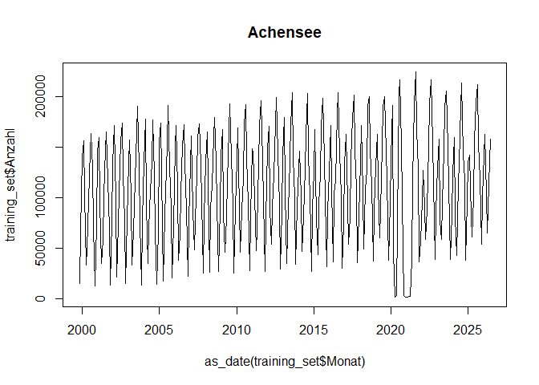

Dokumentation Nächtigungsvorschau
================
Nicholas Katz – JR POLICIES, Karsten Reichold – TU Wien, Martin Wagner –
AAU
25.08.2025

-   [Einleitung](#einleitung)
-   [Genutzte Pakete und
    Hilfsfunktionen](#genutzte-pakete-und-hilfsfunktionen)
-   [Dateninitialisierung](#dateninitialisierung)
-   [Vorarbeiten](#vorarbeiten)
-   [Prognosen](#prognosen)

------------------------------------------------------------------------

<img src="data:image/png;base64,iVBORw0KGgoAAAANSUhEUgAAAO8AAAAqCAYAAABbVQy+AAAABGdBTUEAALGOfPtRkwAAACBjSFJNAACHDwAAjA8AAP1SAACBQAAAfXkAAOmLAAA85QAAGcxzPIV3AAAKOWlDQ1BQaG90b3Nob3AgSUNDIHByb2ZpbGUAAEjHnZZ3VFTXFofPvXd6oc0w0hl6ky4wgPQuIB0EURhmBhjKAMMMTWyIqEBEEREBRZCggAGjoUisiGIhKKhgD0gQUGIwiqioZEbWSnx5ee/l5ffHvd/aZ+9z99l7n7UuACRPHy4vBZYCIJkn4Ad6ONNXhUfQsf0ABniAAaYAMFnpqb5B7sFAJC83F3q6yAn8i94MAUj8vmXo6U+ng/9P0qxUvgAAyF/E5mxOOkvE+SJOyhSkiu0zIqbGJIoZRomZL0pQxHJijlvkpZ99FtlRzOxkHlvE4pxT2clsMfeIeHuGkCNixEfEBRlcTqaIb4tYM0mYzBXxW3FsMoeZDgCKJLYLOKx4EZuImMQPDnQR8XIAcKS4LzjmCxZwsgTiQ7mkpGbzuXHxArouS49uam3NoHtyMpM4AoGhP5OVyOSz6S4pyalMXjYAi2f+LBlxbemiIluaWltaGpoZmX5RqP+6+Dcl7u0ivQr43DOI1veH7a/8UuoAYMyKarPrD1vMfgA6tgIgd/8Pm+YhACRFfWu/8cV5aOJ5iRcIUm2MjTMzM424HJaRuKC/6386/A198T0j8Xa/l4fuyollCpMEdHHdWClJKUI+PT2VyeLQDf88xP848K/zWBrIieXwOTxRRKhoyri8OFG7eWyugJvCo3N5/6mJ/zDsT1qca5Eo9Z8ANcoISN2gAuTnPoCiEAESeVDc9d/75oMPBeKbF6Y6sTj3nwX9+65wifiRzo37HOcSGExnCfkZi2viawnQgAAkARXIAxWgAXSBITADVsAWOAI3sAL4gWAQDtYCFogHyYAPMkEu2AwKQBHYBfaCSlAD6kEjaAEnQAc4DS6Ay+A6uAnugAdgBIyD52AGvAHzEARhITJEgeQhVUgLMoDMIAZkD7lBPlAgFA5FQ3EQDxJCudAWqAgqhSqhWqgR+hY6BV2ArkID0D1oFJqCfoXewwhMgqmwMqwNG8MM2An2hoPhNXAcnAbnwPnwTrgCroOPwe3wBfg6fAcegZ/DswhAiAgNUUMMEQbigvghEUgswkc2IIVIOVKHtCBdSC9yCxlBppF3KAyKgqKjDFG2KE9UCIqFSkNtQBWjKlFHUe2oHtQt1ChqBvUJTUYroQ3QNmgv9Cp0HDoTXYAuRzeg29CX0HfQ4+g3GAyGhtHBWGE8MeGYBMw6TDHmAKYVcx4zgBnDzGKxWHmsAdYO64dlYgXYAux+7DHsOewgdhz7FkfEqeLMcO64CBwPl4crxzXhzuIGcRO4ebwUXgtvg/fDs/HZ+BJ8Pb4LfwM/jp8nSBN0CHaEYEICYTOhgtBCuER4SHhFJBLVidbEACKXuIlYQTxOvEIcJb4jyZD0SS6kSJKQtJN0hHSedI/0ikwma5MdyRFkAXknuZF8kfyY/FaCImEk4SXBltgoUSXRLjEo8UISL6kl6SS5VjJHslzypOQNyWkpvJS2lIsUU2qDVJXUKalhqVlpirSptJ90snSxdJP0VelJGayMtoybDFsmX+awzEWZMQpC0aC4UFiULZR6yiXKOBVD1aF6UROoRdRvqP3UGVkZ2WWyobJZslWyZ2RHaAhNm+ZFS6KV0E7QhmjvlygvcVrCWbJjScuSwSVzcopyjnIcuUK5Vrk7cu/l6fJu8onyu+U75B8poBT0FQIUMhUOKlxSmFakKtoqshQLFU8o3leClfSVApXWKR1W6lOaVVZR9lBOVd6vfFF5WoWm4qiSoFKmclZlSpWiaq/KVS1TPaf6jC5Ld6In0SvoPfQZNSU1TzWhWq1av9q8uo56iHqeeqv6Iw2CBkMjVqNMo1tjRlNV01czV7NZ874WXouhFa+1T6tXa05bRztMe5t2h/akjpyOl06OTrPOQ12yroNumm6d7m09jB5DL1HvgN5NfVjfQj9ev0r/hgFsYGnANThgMLAUvdR6KW9p3dJhQ5Khk2GGYbPhqBHNyMcoz6jD6IWxpnGE8W7jXuNPJhYmSSb1Jg9MZUxXmOaZdpn+aqZvxjKrMrttTjZ3N99o3mn+cpnBMs6yg8vuWlAsfC22WXRbfLS0suRbtlhOWWlaRVtVWw0zqAx/RjHjijXa2tl6o/Vp63c2ljYCmxM2v9ga2ibaNtlOLtdZzllev3zMTt2OaVdrN2JPt4+2P2Q/4qDmwHSoc3jiqOHIdmxwnHDSc0pwOub0wtnEme/c5jznYuOy3uW8K+Lq4Vro2u8m4xbiVun22F3dPc692X3Gw8Jjncd5T7Snt+duz2EvZS+WV6PXzAqrFetX9HiTvIO8K72f+Oj78H26fGHfFb57fB+u1FrJW9nhB/y8/Pb4PfLX8U/z/z4AE+AfUBXwNNA0MDewN4gSFBXUFPQm2Dm4JPhBiG6IMKQ7VDI0MrQxdC7MNaw0bGSV8ar1q66HK4RzwzsjsBGhEQ0Rs6vdVu9dPR5pEVkQObRGZ03WmqtrFdYmrT0TJRnFjDoZjY4Oi26K/sD0Y9YxZ2O8YqpjZlgurH2s52xHdhl7imPHKeVMxNrFlsZOxtnF7YmbineIL4+f5rpwK7kvEzwTahLmEv0SjyQuJIUltSbjkqOTT/FkeIm8nhSVlKyUgVSD1ILUkTSbtL1pM3xvfkM6lL4mvVNAFf1M9Ql1hVuFoxn2GVUZbzNDM09mSWfxsvqy9bN3ZE/kuOd8vQ61jrWuO1ctd3Pu6Hqn9bUboA0xG7o3amzM3zi+yWPT0c2EzYmbf8gzySvNe70lbEtXvnL+pvyxrR5bmwskCvgFw9tst9VsR23nbu/fYb5j/45PhezCa0UmReVFH4pZxde+Mv2q4quFnbE7+0ssSw7uwuzi7Rra7bD7aKl0aU7p2B7fPe1l9LLCstd7o/ZeLV9WXrOPsE+4b6TCp6Jzv+b+Xfs/VMZX3qlyrmqtVqreUT13gH1g8KDjwZYa5ZqimveHuIfu1nrUttdp15UfxhzOOPy0PrS+92vG140NCg1FDR+P8I6MHA082tNo1djYpNRU0gw3C5unjkUeu/mN6zedLYYtta201qLj4Ljw+LNvo78dOuF9ovsk42TLd1rfVbdR2grbofbs9pmO+I6RzvDOgVMrTnV32Xa1fW/0/ZHTaqerzsieKTlLOJt/duFczrnZ86nnpy/EXRjrjup+cHHVxds9AT39l7wvXbnsfvlir1PvuSt2V05ftbl66hrjWsd1y+vtfRZ9bT9Y/NDWb9nffsPqRudN65tdA8sHzg46DF645Xrr8m2v29fvrLwzMBQydHc4cnjkLvvu5L2key/vZ9yff7DpIfph4SOpR+WPlR7X/aj3Y+uI5ciZUdfRvidBTx6Mscae/5T+04fx/Kfkp+UTqhONk2aTp6fcp24+W/1s/Hnq8/npgp+lf65+ofviu18cf+mbWTUz/pL/cuHX4lfyr468Xva6e9Z/9vGb5Dfzc4Vv5d8efcd41/s+7P3EfOYH7IeKj3ofuz55f3q4kLyw8Bv3hPP74uYdwgAAAAlwSFlzAAAOxAAADsQBlSsOGwAALCpJREFUeF7tfQV4FVfz/hu9cSdGILgGd2vQAsWKBPdiLVZc+2HFC6U4LcVdW7S4uxWCBUIgISQh7n5z/zNn97Kb5ELb52v743v+eR+Wuzt79qydmXlnzjkbIx0BBShAAf7nYCz/FqAABfgfQ4HyFqAA/6MoUN4CFOB/FAXK+xHicdxbLPe/hHnXDyM5O0vILoQHwWhmB7Tc953YLkABChJW/yL23goFP+zA4HhM7eIjZDNvvcWss6+BHB18yzjifOdSQl5551z4P7sDWFjj1bDv4W3vgutvg3H82S3MatRFlCnA/98oUN7/Ejmx4dCSp8yJeAnzBh1hRLJngS+weOkP9HQBO1tbLFkwV5TddCoQAyb9BhS2h7uTBcI3+wn5MlLgMb8FU2FzWNIxMcOrwNLECBMu7sV3lw+IMvu6jEPnMjXFegEKwChQ3r+AhIffIj3kILKTnsKj42sYmzsJeXSfYtBGBMPY1hEu20NgZGmD8xcvYcbc+fBwc4NGY4HNP60RZW++jEWdIb8ATlZAaiYS9/WErcYUh18koP2OAJJb0IkyEDO2Gq2aYu71I5h+bqcIcMY38sPi+p+LevIiKj4Rb6Ji4WRrg6LuLrI0PwJDI5CSlo7inm6ws7aUpQX4X8QHlXfD/fOoWaQsKjt5yBJg4sU92PD4GrE8HfqXrY2lTXvKexQ8iY/CpAu7cKjDSFkioenuhTjZdSJMjdg/STgS/AjpWZnoUqoavrn6K1oVLY8GXmXkvRLGnd+FJY2740jQfWx+dJXcnZakRohKS8D57lOxJ+AmrIhetvWuKB1A6HF0HXa2GYrwtCT0O7IWJ/0myHsUZNM9fLZvCfZ3GAFbc1KaPEjOzoTt6lGIHrIUzhakbIQ3e22gTUlBTjZQtF88jM3shTx+aitkPqZrS0+By+63MCaa6//wMb6eOBnubq7Izs7G7q2bRNnAt8ko3Xcv4GxNmp+CxMN9hAIfIQVuxwrsTNcSl4G48dXhoDGh+9+NpbeOAWnJeDlmPYqRkVCgw+jlW+EfFEKrOhgZG8PV0Q7LhveGm7NS7kFgMGZs3IfElHQqliPo+ydVymPWQImCv45PRUBkMr0bsZkbVDjLyBgNvB1gZW4qCwugR1p6Fj2iv98H5lAoZWOlkbfy44PK2/OX5eherTnae1cAq4vpt374ulFXzG/QgRyBEb65cQSLTm9B4rQ9sDU1kw4idKLjTr5+imu9Z6CSo5sspZPN7oTaZevgRrdJsgSYces4IqlRrvnED+W3zMTTyFfQjZcauR6Oy4chbtRajDi7HfE5ORhcrg5StVlIzcpA51LVMezMFrjauWJ2rVbyEXSumR2hm3kQD2PfotL3X2ABKeikmsp+xuSrB7Hw+M94M2UHPK3sZKkCv8NrsI8VkpAybgOs5HsM22sPbUYicjJJgfunk8JIDzh2fGPkhDyBNj4SroeSYUQG5b7/Q4ybPI0U2A2ZZKT2yAocFJWCkj33AK6kwPGkUEf7Cvn6+1EYfOwVYE91JmQia3JNoVDNDizD2bunoPv2qCinR5cZPyAqOgaW5maCsvPLzNJqyTAZ49iiCbC2tETgmwj0mr0SdhZmMCHl1pdLychA+eLe+HHCYOy/H4p1N9/AwjiH9uQGN5FUIw02dCwLbycbWVoARp1vduFmUCQxo38g90vP3dTMGKfGd0Djil6yUMEHz6gxNYepfFG2pEC7e0zH975+sCC5OTXkhRTjXRyyBHaLpYanx8Fnt+E/YC6mnt4qSyQUKuSNsnZOuPwmUJbQOUxMaZGUIisjBZd7z8RnB74X23pYmUle0ZisfxWXwvAlz9yavCwrLoOP53pyQfak6dpsjCGvPfniPrGtxsJrRzG4fkdkUBlD2NvuS3i4FqUTWMF62RBSCKlhe/ol0HM1gQnp1+vtisd2+u48YGYOE9ciiOrhKWRVKvlg0tgxiImNgZmpKQYOGy7kJQpZ4/KqdmQJkujhalByKFFpwqAqhdClMtHedDKXtmZwW/1AyM90+hqwUXtcYOfpKwiPjIaVxpzaDiklLfxrTucxImowf/sRUW7WxgPCs5uamOQqZ2NhAf8XIfj9aSDsLDWkuDqKtZFvsRK/1JCMaaUA79Bq4S+4GRhBbY3anjGZxD9a6B2ADOi7bbbKlrStXihUerffzATZ9J6aTN0hDGhe/KG5MKMXFpeZjrSsLHQtWUWWKmjkUQJlXL1xM/K12F5NVHtCnbYoTg3tyMPLQqZHVEoctrQejEabpsuS3EjPzkID92K4E/ESkRmpsjQ32HD8FTCdySYv3b54JVyLImop40ToM/SvUJfCy9QPEp4wMkL8DKCxhNXKEbIU8Ooeh6wU8vD0jN8eayhLSYFX3YX27WsYkfFIXNxfyFo0a4wG9epCSx4xPiEB6zdtEfIGZVwwb3gdEfsGhSZhyeEnQr63TXFYW9Crocpj07Iw7Ro1EELi2J/Frx6XHgTQ8zChYnQRKvC2BXniq/5SfU9ehgjDkbccQ2NihIsPnsJSQw1H3s/l1IteXoDcOOFP7YmeW8Mynmji40XesbDBxZeWllW84WRDhp4cQOuq3qJ8w7KFgUxyHKpnbEUK26pKMTSl/bVKEmsl6gx6R8ceKG1Xjz9UXvZoh175Y0SlRrIkP9qVrIqjIY/F+vBzO7DIt6tYH9u4KzY8uiLWBWQtWfrZYHx5Zru0YQAhw5ahMMWaeWFLCjT18gFU3joTFbfMIEXJX8YQolOTsbb1IEw8odDxMSc2YmXLgYjNIHory9QYw0kiGUnDlwPJ8ciiWLvVwWVCZmxmC9dPtyEnnYxO+BWkvJTux9ihECzbDIIRPbe0k5tJkYOFfPqkCcggmsrZ51179yE1VTJOU7r4wMqOXLijBcYvuyZkjNcDfUTcC2tzzDsjvThb89zxT0p6BnlQw4rFSpdFBpdhamY4TuUyxrSkZGSJ3wL8RZiQ+iSk4vz4tjg7oQPOTfzc4HKelt/GtkWzku4w1+bg2Bip/GmSIY48gB60r7StJY6PbYMztH/7oOYUUtF+Oo+ht/NB5eX3qSV37U7x4OuUeFmaH8nkvd7FjNTIjz6/g+3+F+FoaYuJl/dLchXGVGtGsd1ZsW5KVDgvNEQVBlVshG2PlcbM4Bj3y8q+ONdpDI5TDHuz+xQhZ0aRr+2pBJlEiz0o/rxMcbgeT2LCYE3nySRvaAjpGWkYeHqbWGcDtrEj0daMdJwIuI1jL/2F3LpYL2jcfGBiSQbiTG8hY9h9/RO0kWEwcfdGwvwespQUdcI4RMfEiPh39vxFspQ86JwWQATRZydLDF19Q8gcLUwwvJ4HnZOuj5S79UEl1NDjfYr7Dn+wW48/WawA+UBPjhofO8c/A07yZqsKJ6ZnymsKMkmB9UjOJOP7AaOaS3NYUTkDqwefKDU7Ey29yuLXm8dlaX6su3IQQyvUwwiKcfvV74AniTEISU+Bu60TYlMSkWXg5p4PXoxyG6fDw1rK1ubFmk/7oc8vK8S6vo3m5OTA2coWznRMUftCKOUsZcGNKM7MlEcivYMB2j31Ez+se3ARC279hjkGsuRqONB5Nl7aK28B/cvVhoOdM7k/J7RRxeSurS4jm/TOmNh8wr2pspTofaPPBUXKIgOk9761a9aAvZ0dTCj2vH3vHhISE4W8enFHFCtFdZub4Mc9kmFgrGzmxRaLYxf89jCW3kX+ZNKHUaCW/zgszLH56lPsuPYM264GYNPlp1h67B6+p2X5yfvYRvKtJD907yWCYpPpVf75d6JSRYPIpbxp5KE0SwbIW8Ch4IfwcXAX67Pbj0C1zd+IdTWa7/0Ow327ifVVF/dgU9NeGF/jU0yp1Zq8ZwPMIYUZfUafuFKuphgpQVlHV+wJvKtKNuW+2uM9p6HL4TVwIA/O4L02BmLe9iWqYDd5ej1EEzfLTTEZcxt0xKxrh7D49nFMr9lSlhqGeMR0jdxNpcfyJt3JJSeL9Z8eXhK/3FVkWaQOjOgW4u/OFzKGVddJyEmIgolLYaTskgZpMLp27igocyEXF2zbuVuWAgv6VSdTTDTZ2RoTN9+VpWQ0alDck0V3ZG2Gpb9HydICfBygFmlnicHrz6HXiuPoQ8uAdaeoPROjy9YiMCIBfeYfQN+Vv6HD4kO4FxwFjenfl/TLpbw2pmYo5uKFSltmou7uhfC0dYa3rYPY9029dmjsXRFGy4bA78ha9D2+HiYrvkIZUsCVzXpj+/O7aFC+niirxjRSkjVnJPqJNBW/J/z6+SgcuX74nYOIyeMtWxWriEdxbxEv+nXZAxtjBNXlumk6nDdMgxGdn9HMsxT4yDIkn3JxH0zm9cC+HpIX5Dg1PjNNrDPc7J1Rza24vMXjIdKIYeT3aCK7RzHmUhXj6FO2NqfEydraYIZKblvha9FtxPeRFiZ15ZiVrwsdswFzC6SrYu0ObdsgNjYeFhoNjh4/IUuBbvWKiMQVrEyx+KCUP2CMqF6IKs0WiYuKzgWDKv5uXH74HKGR0Tj/4BnexibI0r8A9ijW5CgoVoW1BZwdrDC8ZRVMal8T41pXpTZBKsb7eDHNHyLmReaf5eCEfLW96P8tlpMnXVCvPR73my1LJXzfuDtCh3yHEZU+wQCiya8Gzsfq5lI3UWPPkjjSeaxYz4uHcr9twKjV4leNiMk7MLlqU7H+eIDiufS4S973cpfxYn0GGZDHfWfhQoeRuNxxFO71mCbkjGC6li2fDkB1t6IIHrEKnckbM2qQ59vaXlJyxvlOX2N/22HyFnCE6i5OHjYvzOTuK+i0uB0dKq0TOlVoQLIchL95JktI34p1hzYdousoNUiJ8TUNO1PsQQpJjEZLMbYexYsXFSEAIyRUqdu3QTGOVciipCMhTQoDahSil55JxovklZzys4n/VRiihB8YcvCPgQesaExNoTE3fRee/TfQqpSPE4F/KXSh+PavPAKDpqCJd3k0Llpe3sqNwlZ28PWuQGUqoogqXi1M6w4GRikxKsqxaRkHV/GrhhvFlo4aafRScfv8w/osiQ14y8rF5co7ur1bqpJiqlGXDIgfeceidooyMiX3sJbYA8Pe3JIW5Tq9bB3f9WWr8TnFuEgnf06U/VDALVkKtChRWfa+1jitUmBzZxvxntLDFeU1JwOny0yHEZ0j8+YxWQrUqVkTmVlZsLGxxq3bd2QphSAV6fkwRbbR4PA9RdnFkEmSl+KBGx8J1vxyCidv3pe36LmMniWvAb3nrsbz1+FinZM0Xb5RcgTdZi4Xv78/D8KcbYfEOmP+ziO49lB6nm0mzMNX32/C0CU/o/eclULGI9TaTV4k5H2p/nWHTgs549rjQPT+dhWGLd2IBduk/nJGzzmrSJlyEBETh/6L1mPAvDXoP28Vrf+M4HApBGlUqSw2nrwKbUY6CjlK7fnA+esY9B2de9ZyOtcaHLuh5CH+Gv4Ga/AB5Gu1c27/hkYUx/LS4fAqPIp5I++RMPrSAbGv8b4lqL97EUaqYkLG8LM74L52LFr/KiWb9NgecBOf7FsqjvOlperOefIeBUyOi21UvKkanX/bgE/ovA33LEa/ExsQy4qVB5xB9tkxFyV+mgiP9ZPxkyoOZnx35yTuRCmejjHywh5EyXGsGtXZMBClhrEJHSP1YTNaE5UXcjML3Ah/KUtJlz38hNXMipeSUAyz8vVFjMwJNW2klLRilCxRApkZmTAli/82UoljK5dxJorMCSoTvAhXrqmsHcX5f4FO/RuIS05BajoZMRmvI2PkNSIOickYs1IKlbgLKiwqTqwzwqJjodXmoFqZEth/RulG3HXyEuqTIjEi45Owekx/LP2qF1aPHShkrIQpGdlCvnHyUJy6+xSBoZKB+3LxT9g8ZRhWjOqD5rXIuMoIi45DDp3L3dkRa0f3Rd0KJVGzTHGs/boPirgpjuLw5ZvYckIZk9Cmfg2so/OYWlhiUo82+LRmBXnPfw918jhbS+80j6tVh3Cij/0Drjif8u71v4SJ1Vvg+wYdMaqSL3zWjcMtOVvK+PHuSSxt0IlodTssqt8eQytQA5Ux+/ohBFOM+mzQQrhZ2mEYKZweV1/6o2HhkqLeBXXbid+8mHFpP+Kz0rGWriEvDpDn2tC0J75v2BHNvMrBeVEfZKpubNn986iwfiJWNOyEsxTvMj3e8vgqym+QupMYt18/QXCeLq/Tz24jKSt/yl6APTg9QP/4SFkAePMoJ6bC5K2zVDG6mV0JetD0TzVYy8S7HMXCxKeNTJCjqqNsmdJIJ0vPI51i45SGXc7TVtBj7pTXpSsVWfFIHBuZxn8k4PyDum/YVBXPaSlMqFHGGysPnBTbJtwfKoMz7fpxwE1qVsbDwGA8fRWK+lUUBTGhulPS0xGbyDkS6Rz8v6lcD9fBI8T0+0xNTXD/xWskJKeiZll6DzJ4RJkeFhpzWJjzyEBT8avvZjt+/S76tvJFBilSGhlUhsbcTJzDiK7D1toqVz3/HYyQwCGQDA9Ha2lF344zs1DGVWGz6dxVxNf5Hv3Np7z8PhoVLYuaREGbFfPBnSFL0euIEqvyAbU8S6Bu4TJoWKQcfHj4oIyfSYH2k9LYEdXd9Gk/igElOixAFVd1K4ZqHiVQz6sMmhig5XMvk/IOWYLhJ3OPbRagmyjl7EnnLoW+FetjRutBGHlys9gVRUo05uAy6CZtE/UWs3FAWSd3XOo2GT7uJbAzUMrempuYwywPRdaYaXI1QjWcmG7Tg01gmqwGD5OkY3LkRBrDxMadw2Px/PQwJgOGbHryJGT6rIenh5sYQMFFc1T9zDY8NI49LL8s8r56JBFl9nI0HJL8X4EVMNdzUzWw1CwtZn3RFXsu3kJ8UtJ7G3/bOpVw4WEgzvs/Q3ta14PHZk9Zsx0zft6NUzI1Z2VNpLqm/rgHLScuwuf1KqOUlxSO7Zk1GttOXMSENTsxcrk0es0QmMLnjav3XLyDXs3qwc+3FnaekcaxK9CJyQF/G1gRE9LIMCnOYsmQFkAssSx6ZiADsnWkMv7+8L0gstwcKhm+hnzKy1CP9S1JcWhoiioLl+fm1ehcuib8iC4nyp5sFXetvIMO1ga6b/S4RfTc11uaoG5DMWk0U9NcyK1gZSnmjU2TKOr4M9vxXZ4ZTHrs/WwweshjoLnBOWpkayfD+kPDLcW96uCkMZDlpV3sffQwsfQUOm348VBDV52HLTqX44ZkYanUncxZZX7B9CI9ecKCjKCkTFT5yJJV/DayVO1EUEAZnARirBjeC73nrSWjZJg1NCPPe/LGXRy/eg+t60nviGFOhmv5mC+wYepX6NykrpBxgo9Hp80b0hW1yxaHjaVizEp4umHpyL7YOGWoGPjw+KUS5qiRuwVJ13njwROspfj90r1HOHRF6aL7x2BjgRFblHBubNvquL6gF8yztdBtHwV3O8Xhzf/lNmD5/vZpUHl51FMYKWx0WjKKExX9pr5CcV1ImatumwWfzf9BmQ1T0f/4enkPxPRAHkRR6sfxqLo9d6ba3sJWdC9V2TKDjv0G7lSvGuNObsEK8qaMDaRw0/LE0no8jY9CBF1bzz2LMKLWZ0J2Oew5OpauJtY/BB540ZVYRPUtM8V11N4+B1fp2HyTGmTEstGiNlnOLk8iTSgtNVC1Qsozi4ghv0NOKhkXprzU8IxUyToenMHeiBukq4tS9xOOc82pAlLiJuUKyVI6PDodlRw+LuX9vGENrP/tCu48e0Ueci+6fvqJvIc8b0YWKXM2qpQuhirFiyBZRRVTiZrqVN7M280VHi5KQpGRkp6FG0+CcPr2Qxy7fk/I2Gsmyx5raq92+M9mOTFFck5qXbj/FOd+f4JXFAeXLipNCuFz5ciGhME0NCNLMTg/HTmPHs0aoE2DGviyY0vSBuN3iTZGOpXVqtjVn4HaQBgkdFbm2PTb7zj2+ytZAFQq6iL6htVoOveAZMgNViLBoPJyhncbUc1C83tgGinIFNWAhqTUJGxtMww/k6JtajMU4+u0lfdI2PjpAEQOX44OpWvAee0YWUoPMjMNo6mezXTM+taDsU/VXcO45H8BAVHBWHz7BL28VPx45aC8JzemXdoHj1UjsbXzWPgWlj4Z42llj5eJSuz4PqSQN59Upx0207l/JgOxs/1wlHXxEn3BBpEUQ40jB9WcpMbACEmm87DSErso46LIczJjhaKbqGbMaV89grG5FcXBmTB2LSJLgZevgqHRaETG2ctLqcP/eTTxeDIkGdko7a6qiGizlfXHFfOW8/bCgkF+OHP3MSqWKILZAzrLe4Ch7ZsJdsGY/YUferdUJm4MadcsVww8qG1jDKPyanzV8VMyCi/x7E0EngRLymRKBnZQ2yZi3dLCArMGdsYTipW5cY/t1gZ3n7/Cw6BQ7PrPCIo4JAvK5dWUvQbFw3V8lLniTo72pLQtUJaUvZinK77p3R6RcQrL9POtDUfb3Eztj8BTLvUQvRiGdM/FFm2+3Y/Juy4jizyuOT0Pc/m4p2FxqDZ1J849Ivbwgbm8DOVMKiRRjDexShPyFm7oX6mBLJWQQQ2R5+jWoVi3vps3fCi21GP5A4UOzKrdBrGvA+Qtbn9alLN3RVWKW+vSsQ0pFtVjpf9FfFb7M2RQXOhIiqGhF1K5ZFWcCVW6YvTY3+5LqiwDvXnAhIzelX0xw8CUP0ZKdhai06XBIdkUS5V1KIRKdM01SWlL2jrBihoFW/W8uMkZZqbYFE/7llDisWOkkDzDiOXqyf9ZiUHCIVu4tZYlQObDS+KrGrqUeGiqKwbw0ZMnsCTal5iQiAb1lIEtZx9xUkuHGnUVRd/1PJ7iX2OK4T+umJdRqWRRTOz+GbrK1FaPQW2avGvEnPj5orWvWGcMatNYTjZJqFzKG1XJQ6sxrENzfNWhGS3NMa6bxK44KTWwlTI5pkO9aihfTJrjWr1McYzp0gojO7UgL650Ew5s/Yk4vx61KpRCnQql5S2gC7EHFwdlHjcrd4PK5eQtoFPD6nCyk0b3/SmQp4wm1lFm/BaUGLMZTRcSOyBFzQ/SaGdbLPz1DiwGrUX1mXsQRwyt3KRtKD9mE34PI0fAgzr+APmUVx3QPxu0AC7LcnvID3Wkj96/BHpSksQZWbl/l8HHacwMe49xp7fiQPsR6OXTCIOqNkG3CvXwU5shGKlOXKnO+yPFt9W3KbR8qE9DXAl5hNV5stRJZAxs5najGFxKFnHMm5nHy2pVtEqNg0+ukyZS/EGGgsd263Hy5X3J85pZwE4Vw2dG3+ETQOOmNLDMuyepnAY6MhomHsqornPnL4luIicnR+FF9Dh3OZgOysHwVkoDOxZIymtihIofWcybmJ6NNE6yyHgZJ+UoeJBCLI/Hfg94imNeMJV9Fp2KNJ4eJ4PriUhMx5v4NITGp+JtskSZ0+mc3GWkRwJdR4Y85pv3hb87Jg3xPGKNEJmsJBw5GRYnZ/L5HFyevyISKdfPSCLa/pqOj0qS6kpUne+DkCnuc6rvZRJdQzKP3DHgH/Xe2M4SOeam8Cdvy5FEQAyFTfbU5nh65p9Avpq5P03viUpRrNeSPODCO8owPkcbezTZOR9Nd85DQ1KgUaeV7N7FId/BbHF/1N+3BHZLB8O/r6JgNkQfvz61Gc13zafj56IyxcyMCIqrs1ixVdaYUZs845NgZZggj1LSYzAp672Il7hEix7aiVsw79ovqLHlP2h//Gc04Wv4YSjufvk9Stg6S2VIcfn+1OBsryHPa8Qyosbdqkijv/Q4+JD7JnXom2eKZHLgXuRQG7Epp8z5zbx5hormwKKxkrjjeDc49DWxjEy0b6N46YO33hAfpJdGDX9AE4WVbPXn/lNS3o8s27z+ThhOPZXmGa+8GoLNd6TxAKFxyZh6QTXARIXnbxPQYftDeUtCeHwK+h8MwKYbQRhAvy+ipf7twKhEDPo1AEvPBWDB6afYKg9aufQiCv0OKoxsze1wXAyUuuEOPwzDqF/8sfR8AObRMaeeSfIvqF7R7UJ4EBaPxdcleWBUEgb/EoDl559h8uEHmH9Jmnp5IzgWi84+w5AD/vjPMX/cCHn/jDoBngnE2sdthtdZYXmdY1aGkKuchmhbtM2L6Bqk8qz4/KufVcRliFJ/CPmU9xe/CXCzUHj+b13GoaWcBWZc6T4Fy1sOoGUgVlPcOJrosR6NCpdGyFc/kHI1QvToNfBRjYAaX789Dnccg2UUEy9v+YWIOxl8AVE8X9YAQidtQaLcxfJgZO6hlUlfr4OnPGGBwfWEDlmCDW2/hB/R3PFEw3UTNqOaq7dUgLCweV/yorm/j3XQbzy8VSOw3oE5cGI0lqoy5ut4bjJ3fyXHY0Id5b7TQg8KY2rmUgjGptI1pf66AsbOLuLrklaq72etWveTSFLFxsahV3dpQgdj2rZ7wsOO7qFQ9INBiZKV5hf5D+PPnEHfP8vgFJ+jlTnuhsbjcWwGZjaX8g9MlzXGhmv79XkCytkZ4fpLiu1lrLobjS+rF8K8Nj6Y27QoDgdJfeesC3VKuGFJx6pY2aU6xjeSqLWFmQnik5Ox7ro09sDMSEdxrdSMeUZct8ruWPJ5VazuUg1+VSVazT1w+hjcjJTETP+pHypfu6QrFlP5DT1q4jopaWJaJpqXdcOKTlVQuog7vutQGS1K5x/59w7kDLwcraDhfm5SRA/2nOS5CztYwZInIdCN8EyiIg42kmLyu6SfUq62KO/hgCpFiObz42I57S9ViGg8XYMJHSM+OaRXZgOQ7kiF0nbOubpAGOphiMVsHEXMyLEuf5iuJE+TU4GHTA4oVxvO6j5egisZBD6GFz6+GsW+Qk4xYd6yevBQTDt5KGMlFQVn8Owi7sbKiyp0TTyBoI2BfmS+NitVhphRiq5fnWTQI4XocrVydXJ922oYf0CArseDY31HJdaPvTpYPHvH2j/JEtLvjdPFN6yM3YvDTO6q4gTV2fMXkJaegcEDlE8HBUUm44n/WzppJpZ9oXzedRR/z1l8GkWJ2/4xcAP6AHi3nu0xuK2GxqVg8vlwTKuvPIsP4UxABFZ8XhF7nymj0BKIrZZztREUlz9g0L+SZEi58YZEJwlvuvNBBMKIijKYGnf3ccOlN0SLiZZaqD40wH34T6JScDUkDqcC48hxGW74RvKdcD91FNHbgKhk3CRva0E3Zafqmsmkc/0hZSZFnfRpFXzftT7ciAKHLe1HFCMcoUv6wYpPQ96zjrsDrk7vJPXnMnKy8XxBb/zcpxGOjmwNC/3DJxbyfEEvNC1fGCWIOj/6lhxHTBJbHml/HuRvtQUQiEmKxXnyynos4llE2cSLyRufIQahR+qrbchOjIEJKZhV0Q6S7PAqaojGyHkbDIcZ0neXGXMXLkKhQoWEp+jWRcnONp1B9Jrcw/wRSuLnWkQqQiOpwZI1H8DftPoHwR6rqKMlskVzMKDFtD+LaD57Ez1McrKwhSj9rPpOmH1Z6V55Hy48j8RnFb3E53mCIpmGyuchz8nG82lkEnb5R+LLQwolZk9vxqOiaNE3YM6daI1NsbCpF8afCYaFUc67ts0sNS5Th+BELV4mc4gknYP7c4nUCJhQYVksjksgg/ngbTpGH3uGbZ2VZBVDDE/8I1iYYdnx39GiYhG0rymFOxofaeBSTGisuKgsMiJSd5l8Yp1Ub8M5B1Dpmz1I5z5y1bnOTOmI2NQMEc+r5Xnxryuv+OyoNoN+8/N5nTYN2rRIChOV5AFDpx5zSMh7rE6bSsdFkVyVDGFXKIPrE4tW+uypHto0KWYzhPkt+sJO9tIRqYmYdGoTvXlTdK3aFOUdlT7byNN9xKncWktfwGAkraC4lxqYhsIL02ISDX4TFo6r128jJiYWSxYo47q3X36F4OcxcHC2wuTPlSGCjfY+l74gSdZ/Q0uF+qvBDZlHAHF/cf5FGU3Ev1LZ/OVYnkkGooidOVxsNMikhqQvr19S6PG3Kp+b+WTABF/Vckc9orbshS8HKVSYvWZeHCNPeO9lGMYeeSzKH38iPXs7jSkCyfPVLeaM/pWd4GIvdZGx4hUl2tiqjAs6l3OCp72SfU3LykZhRxuUdzDD7vthREykZpxBSlLT3Qo9fFwwpKoLNPIoNSsLK0SnSEmrSPLw/KE9Bp/D28UOflS+UyVPHHqiDGFl8L3/IejcL15FoZSzDf7TqQ6+2X8d/rP8sOVqgFBsPaSq5Oci13tyUgcs79mQrH3uEXxfbr6A23N7IC5FGZVnCP+68oYfdMXb33wQts8NCb8rUwDj736LsINeREEH4M2+wkh6Is0mYYQfUDK1jPADSowad2s6wg4URuyV3gjb6/nuuOTAlUgJXEte8SlCd2jw9lgFce6MCCn5FrrTATFXeiDiaB2xnRe5Zkz9RDErD7Kgh777syGyFOJ6+dt0NmU6wty5hpDFjqoDE6b4pOj245Sx3eOmTIOdrTXatW6FIl5SGJJK1rj3zLPUinQI3UC0Ssaki2+gZUsdn4HHA5TuqLzgT6bo6AJyeOx0noXlrJQMnYkZyYgJGCiXQ+V4IhNjebtysLazp5AhRygxj/dN0RqhlIcTxjbK/Q50bNjktj2ncRHMvkK0X0ZIfCYWXQjC7DOB+PEOKSkZzN8j00VcubRtBSxvUxbbAiQaPLSSPX64F4fvzj3H+LNvMLyq/t3q8DgqFQsvvBD1rLsjeXdxzyaSUR3nWwJWtvbIkBM7/JtMnjcvRtUqhHGnQrCYzrH+URK+ICPBYI+YyV9RIIyq5YEVd8gAqY27sTm07BX/CGSszgaEiZFk3268gNIejth49qE0z5fAxoxjdb3S6j16y7kHMPsgGX02TCpDsfbns/B0spVCApU8Lz743eZ/Am/2alDYT7I0b/aWovWnSHy4ChlRF1CoiUIxIw5Xhl3FKbAq0YPKuVI5xSq+2WOKwl2zSeFnQpsaBOeGSsY7/NfScKi5nLwqJzRySKlqI/XFTpItkQoQ4u+OgqZQA1gW6Yboc53h/MkOormGu2KKbZmBYJ5UkByHxAlbYGsmNZzoy32Q8mwbTCzt4NVD6thPPbIayevGQZeZAdejGTAylSzv8tXrcP7iRVhYWGDHJuULkGZddiA7Lh27ZzVD14aSd70UnoJPfn4kaPSIWm5Y4Zt72qMaIW+jxVS599E79iylvNzFqCF9UicvONNubWkBdydFaX55HIVHkSkwNzVBbU8r+JbIT9u5+0XEiLJ3CYpLg5uVKSwp7gukuJMz+9ywLDXmcLc2QyKRIjdrJT59GBYHH0/pU7b8ZdLHb1NQgWJfPp7BX6J4RXXyFzdFPUS3iztZiW6cNDJKrsQSGHFp2RTr6mBDMWIceVW+H2dZadTg+dGBMSmo6sGfIZI9NbGa6HQtCttK7/QVvQsXugcbHihDeJ2QQddsRs/B8LMz6r1CjJhidtS5enG4OVpj9Z5ruEBxq++iXyE+CUvvoDx55bGtq2PwupNS/y0ZjRtEjc3oOpzpPspN2wXR0Uae9t7s7qg2fRe9NyfM6FAbfVZSuEZM49D0LmhXLXd/+P+B8lqQIkp04O2Jz+HaYjtCNtrA+4v8lxGy0QhFB+jIE7ujcBeF4uoNwKv1Rig2yPDlJwUsEwpp7lwHqYGb4FBLyWinhuxAov8auLe5JEsMo8vRddgfcJMOSMKzr35AafkvRyTcn4u4G9PFp2+8B7KlNkJ28BPEDCTaS3rksv0lTNykB/37A39MmPYN6wSOHdwLM7mv23nwL4h9FYden5fHtuFSrBuWkoXCy36nlmqKhl42uNRV6e8twMeHGlN34C7HtZzk4qGb7KXZqJCRgKMVtQXZqDIDYmrMmWhWN170yStuvmIuuFyW5ZxlZjbBVJ+PeR2DpAPj840R/9dpM5kjRJ8fTDS2HV3gIxgZW5OC5R7FpYeYlWMQ0o1aeLQQvx+Csak1Eh+tIIpbmqiyI9LeHIBV0Z6wLTeC6LQpos5Kn6nNi9X3TmO//0VyC8m42G+2SnHnIO6apLhF+/EL4BlDGYgZ5iOepuOCE+8Ul+Pc8VOnU6ydg7XLv3+nuF4jjyD2ZSwakbfVKy6/w8IrHwjF9XHUvFNc/nOftyLzf7O3AP/3uPFtdxGzIzpJZJ3ZQ4pPubJWJVBYwJ9t5SWZ/GoOKXActRfe5n3s/Xlhr64uy/kCcQw5OPLaXPfGie0NTu749z3vPit4dowm45NNiiUpZ8gm8rD981+GXv4+z/u+4xhJAT+Q5zWXaHMQ0eYahv+ubeTpVrDzGQsL909liYTDIY/RfuUonBux4t1XRWIu9UTS453gOQhF+qRQ/VL2NbKjPXKSEmE/aSMsW0gfWo+JjUXPAYPEIJAZUyehYX1p3nPJMUcR9CACdUlxr81qLmQMo+/uCutb2UWD+/2kxNWd6DeouWwodN9Kf/mgAB8nXkRIgzhk3/m3gb/eWtrdgRzce2pm5f03EbrHXF5TEHm2oy75xXZ5S0LsrWm6+HtzxPqb/V7iVw99HW9PttClvNot1vWIuz1Hlx5xWpf0fA0tq3UZsbd1cbdGy3slhB9tosvRpov1mBtf69LCT4j1vDjx8qG8ptNFHPPRvfoJupDNprRFkZWMt52ddBFNoUs5vFqW6HRRUdG6lu076pq1bqc7c+6CLNXpvEYe1sF3va7xnHOyRAKW3NVh4W1drV3PZIlON/XyAR0FvbqnsRGypAAFyI1/3fOGbCZv2S//KSOOVCZ6aQeNewWkv7lBHrMsXHz3iH1BK4xgU647shOC4dnlKl5vMUKRvlIdEYc4znSDeaHSSA+9Qr8V6Li9RJXnEAUxh6VHc4QfbAwN/eZkxMGp3jSYOVan63AR1Dk1ZBOK9CTa8wG83mqKrHgtzN084dVVGgbIn7WJaldMdNnZT1sFq3bSR+7u3b+P3gOHiu8zL1nwLerVkSZQWHTcjozgeHzWozKOTpCGVj6Jz0CFxeRxTYzgV98De1pJSSvbH4aBCfmLgfNQwsDH8QpQAMa/rrwfRg4yoq5AUyj3uGEFnBzigCIv6LhoOs7lfcfpwbeqUJDMmOtkJHLPiPmz0KURbbbMP10sLS0NlqoJ9gweSG8tZzDVSMrUwpbn76rAw0H1o8oKUIAP4SNT3gIUoAB/FobcWAEKUICPHsD/A6RDhr2Z40lAAAAAAElFTkSuQmCC" alt="logo" style="position:absolute; top:0; right:0; padding:10px;"/>

## Einleitung

Ziel des Projekts ist die **Erstellung einer Nächtigungsprognose für die
österreichischen Tourismusregionen**. Diese erfolgt auf Monats- und
Tagesbasis. Zudem können Monatswerte nach Kategorie und Herkunft
dargestellt werden, wobei auf dieser geringen Aggregationsebene
erhebliche Unsicherheiten bestehen. Unter Verwendung von Informationen
zu Ferien, Feiertagen, Events wurden mithilfe eines
Random-Forest-Modells Monatsprognosen erstellt. Unter Verwendung von
Mobilfunkdaten und einer adaptiven LASSO-Regression wurde die
Monatsprognose auf Tagesniveau disaggregiert. Die vorliegende
Dokumentation beschreibt die Vorgehensweise anhand einer Musterregion.

## Genutzte Pakete und Hilfsfunktionen

Für die Vorgehensweise wurden unterschiedliche Pakete genutzt. `ggplot2`
ist ein Standardpaket zur Datenvisualisierung, `forecast` ist eine
Prognosetoolbox für Zeitreihendaten. Das Paket `data.table` hilft bei
der schnellen Bearbeitung von großen Datensätzen (Aggregation, Joins,
Modifikationen).`randomForest` inkludiert die Implementierung von Random
Forests nach Breiman (2001). `tsutils` ist eine Toolbox zur
Visualisierung, Dekomposition und Modellierung von Zeitreihen. `fpp3`
ist die Kollektion von Funktionalitäten von Hyndman und Athanasopoulos,
die in “Forecasting: Principles and Practice” (3rd Edition) Erwähnung
finden. `rangerts` ist eine neuere Modellspezifikation von Random
Forests, die ein “Block Bootstrapping” (Zeitabhängigkeiten der Daten)
implementiert – eine Dokumentation ist hier zu finden:
<https://github.com/hyanworkspace/rangerts?tab=readme-ov-file>. Das
Paket `dplyr` umfasst viele “Quality-of-Life”-Funktionen zum
Datenmanagement und Data Wrangling. Auch das Package `lubridate` umfasst
einige Funktionalitäten, um das Arbeiten mit Datum und Uhrzeiten zu
erleichtern. Das Paket `stringr` liefert viele Hilfsfunktionen für den
Umgang mit Textdaten (Strings). Das Paket `glmnet` ist ein Paket zur
Verwendung von fortgeschrittenen statistischen Modellen, das hier für
die Tagesdisaggregation mittels adaptiver LASSO genutzt wird.

``` r
################################################################
################## packages ####################################
################################################################
library(ggplot2)
library(forecast)
library(fpp3)
library(data.table)
library(randomForest) # for randomForest()
library(tsutils) # for lagmatrix()

# for random forest with moving block bootstrap:
library(rangerts) # https://github.com/hyanworkspace/rangerts # quiet = TRUE to mask c++ compilation messages, optional # devtools::install_github("hyanworkspace/rangerts", quiet = TRUE)
library(dplyr)

library(lubridate)
library(stringr)
library(glmnet)
```

In einem nächsten Schritt werden Hilfsfunktionen definiert, die im
Nachgang verwendet wurden.Für die Tagesprognose wurde eine Funktion zur
Behandlung von starken Ausreißern erstellt.

``` r
################################################################
################## own functions ###############################
################################################################

trimmed_resid <- function(x){
  quantiles <- quantile( x, c(.1, .9 ) )
  x[ x < quantiles[1] ] <- quantiles[1]
  x[ x > quantiles[2] ] <- quantiles[2]
  x
}
```

## Dateninitialisierung

Die gewünschte Region wird ausgewählt (`i` entspricht dabei dem Index
der Positionierung im Regionsvektor) und der Prognosezeitraum wird auf
zwölf Monate festgelegt.

``` r
# Select Region
i = 1 # e.g. i=1 corresponds to region = "Achensee"


# forecasting horizon (in months):
H <- 12
```

Im nächsten Schritt wurden die Rohdaten, Ferien und Feiertage sowie
Events und Konzerte geladen.

``` r
################################################################
################## data preprocessing ##########################
################################################################

# read whole data set (saved as .csv file):
data <- read.csv2("../data/monthly_stays.csv")


# read additional data file containing holidays (saved as .csv file):
holidays <- read.csv2("../data/Ferien_und_Feiertage.csv")

daily_events_s <- read.csv2("../data/Events_Konzerte_daily_K.csv")
daily_events_s[is.na(daily_events_s)] <- ""
daily_events_s[,-1][daily_events_s[-1]!=""] <- 1
daily_events_s[,-1][daily_events_s[-1]==""] <- 0
daily_events_m <- read.csv2("../data/Events_Konzerte_daily_M.csv")
daily_events_m[is.na(daily_events_m)] <- ""
daily_events_m[,-1][daily_events_m[-1]!=""] <- 1
daily_events_m[,-1][daily_events_m[-1]==""] <- 0
daily_events_l <- read.csv2("../data/Events_Konzerte_daily_G.csv")
daily_events_l[is.na(daily_events_l)] <- ""
daily_events_l[,-1][daily_events_l[-1]!=""] <- 1
daily_events_l[,-1][daily_events_l[-1]==""] <- 0

dummy_ostern <- holidays$Ostersonntag
dummy_pfingsten <- holidays$Pfingsten
dummy_feiertage_AT <- holidays$`Freie Tage Österreich`
dummy_feiertage_DE <- holidays$`Freie Tage Deutschland`
dummy_feiertage_Rest <- holidays$`Freie Tage Rest`
dummy_fronleichnam <- holidays$Fronleichnam
dummy_winterbayern <- holidays$winterferien_bayern
dummy_herbstferien <- holidays$Herbstferien
dummy_schaltjahr <- holidays$Schaltjahr

# get events for specific region
eventframe <- read.csv2("../data/Events_Konzerte_monatlich.csv")
eventframe[is.na(eventframe)] <- 0
eventframe <- eventframe[,i+3]
```

Auch Hilfstabellen wurden erstellt, um die Ergebnisse der folgenden
Auswertungen automatisiert abspeichern zu können. Für alle Regionen
wurde ein umfangreicher Gridsearch durchgeführt, um die ideale
Kombination aus Parametern für die Modelle auszuwählen – diese werden
hier automatisch für die Region ausgelesen. Nach derzeitigem Stand wird
die optimale Variante nach RMSE gewählt.

``` r
# create vector of regions:
region_vec <- data$Region[seq(1,428,by=4)] # 107 regions (100 regular and 7 federal state rest regions), 4 categories

# create outputmatrix
outputmatrix <- matrix(NaN, nrow = 308,ncol=length(region_vec))
outputmatrix <- outputmatrix %>% as.data.frame()
colnames(outputmatrix) <- region_vec

daily_output_matrix <- matrix(NaN, nrow=365,ncol = length(region_vec)) %>% as.data.frame()
colnames(daily_output_matrix) <- region_vec


# load the best parameterization based on extensive gridsearch
region <- region_vec[i]
method_sample <- read.csv2("../data/region_method_rmse.csv") 
usemethod <- method_sample[,3][method_sample$region_vec == region]
sample <- method_sample[,4][method_sample$region_vec == region]
fwindow <- method_sample[,5][method_sample$region_vec == region]
block <- method_sample[,6][method_sample$region_vec == region]
lagvar <- method_sample[,7][method_sample$region_vec == region]
```

## Vorarbeiten

In einem nächsten Schritt werden die Daten eingelesen. Daraufhin werden
die Daten in einen speziellen Zeitreihentyp transformiert, um damit für
die weitere Analyse besser arbeiten zu können.

``` r
# get data
data_region_gesamt <- data |>
  filter(Region == region) |>
  group_by(`Saison.Tourismusmonat`)

# create date vector in required format:
data_region_gesamt$Monat = yearmonth(seq(as.Date("1999-11-01"), as.Date("2025-06-01"), by = "1 month")) #%>% rep(each=2)

data_region_gesamt <- data_region_gesamt %>% group_by(Monat) %>% summarise(Anzahl = sum(Ergebnis))


# create time series data frame:
region_gesamt <- tsibble(Monat = data_region_gesamt$Monat, Anzahl = as.numeric(data_region_gesamt$Anzahl), index = Monat)
```

Für die Evaluierung wurden die Daten in einen Trainings- und einen
Testdatensatz unterteilt – diese Notwendigkeit entfällt bei der
Out-of-Sample-Prognose.

``` r
  # consider the whole sample period:
  region_gesamt_total <- region_gesamt[1:308,] 
  region_gesamt_training <- region_gesamt[1:296,] 
  region_gesamt_test <- region_gesamt[297:308,] 
  x_covid_training <- c(rep(0, 242),rep(1,24),rep(0,24)) # Covid period in the training sample: 01/2020 - 12/2021 (2 years)
```

Eine Unterscheidung der regionalen Modelle ist der betrachtete Zeitraum.
Hier wurden unterschiedliche Spezifikationen getestet: (i) das volle
Sample von November 1999 bis heute, (ii) ein verringertes Sample ab
Jänner 2010 sowie (iii) ein deutlich verringertes Sample ab Jänner 2015.

``` r
if(sample == "short_time") { # ab jänner 2010
  dummy_ostern <- holidays$Ostersonntag
  dummy_pfingsten <- holidays$Pfingsten
  dummy_feiertage_AT <- holidays$`Freie Tage Österreich`
  dummy_feiertage_DE <- holidays$`Freie Tage Deutschland`
  dummy_feiertage_Rest <- holidays$`Freie Tage Rest`
  dummy_fronleichnam <- holidays$Fronleichnam
  dummy_winterbayern <- holidays$semester_bayern
  dummy_herbstferien <- holidays$Herbstferien
  dummy_event_l <- eventframe
  dummy_schaltjahr <- holidays$Schaltjahr
  
  x_earlyperiod <- c(rep(1, 120),rep(0,8000))
  x_covid <- c(rep(0, 242),rep(1,24),rep(0,8000)) # Covid period 01/2020 - 12/2021 (2 years)
  x_postcov <- c(rep(0, 242),rep(0,24),rep(1,12),rep(0,8000)) # Covid recovery period 01/2022 - 12/2022 (1 year)
  
  # forecast
  training_set <- region_gesamt[123:308,]#[1:290,] # given the first n observations, forecast the next observation 
  # forecast
  dummy_monat <- c(11:12,rep(1:12,27))
  
  
  dummy_ostern <- dummy_ostern[123:nrow(holidays)]#holidays$Ostersonntag
  dummy_pfingsten <- dummy_pfingsten[123:nrow(holidays)]#holidays$Pfingsten
  dummy_feiertage_AT <- dummy_feiertage_AT[123:nrow(holidays)]#holidays$`Freie Tage Österreich`
  dummy_feiertage_DE <- dummy_feiertage_DE[123:nrow(holidays)]#holidays$`Freie Tage Deutschland`
  dummy_feiertage_Rest <- dummy_feiertage_Rest[123:nrow(holidays)]#holidays$`Freie Tage Rest`
  dummy_fronleichnam <- dummy_fronleichnam[123:nrow(holidays)]#holidays$`Ferien Monatsgrenze`
  dummy_winterbayern <- dummy_winterbayern[123:nrow(holidays)]#holidays$semester_bayern
  dummy_herbstferien <- dummy_herbstferien[123:nrow(holidays)]
  dummy_event_l <-dummy_event_l[123:nrow(holidays)]
  dummy_schaltjahr <- dummy_schaltjahr[123:nrow(holidays)]
  
  dummy_monat <- c(rep(1:12,27))#c(11:12,rep(1:12,25))
  
  # dummys for exlcuding early periods
  x_earlyperiod <- x_earlyperiod[123:8120]#c(rep(1, 120),rep(0,8000))
  x_covid <- x_covid[123:8120]#c(rep(0, 242),rep(1,24),rep(0,8000)) # Covid period 01/2020 - 12/2021 (2 years)
  x_postcov <- x_postcov[123:8120]#c(rep(0, 242),rep(0,24),rep(1,12),rep(0,8000)) # Covid recovery period 01/2022 - 12/2022 (1 year)
  
  
} else if(sample == "very_short_time") { # ab jänner 2015
  dummy_ostern <- holidays$Ostersonntag
  dummy_pfingsten <- holidays$Pfingsten
  dummy_feiertage_AT <- holidays$`Freie Tage Österreich`
  dummy_feiertage_DE <- holidays$`Freie Tage Deutschland`
  dummy_feiertage_Rest <- holidays$`Freie Tage Rest`
  dummy_fronleichnam <- holidays$Fronleichnam
  dummy_winterbayern <- holidays$semester_bayern
  dummy_herbstferien <- holidays$Herbstferien
  dummy_event_l <- eventframe
  dummy_schaltjahr <- holidays$Schaltjahr
  
  x_earlyperiod <- c(rep(1, 120),rep(0,8000))
  x_covid <- c(rep(0, 242),rep(1,24),rep(0,8000)) # Covid period 01/2020 - 12/2021 (2 years)
  x_postcov <- c(rep(0, 242),rep(0,24),rep(1,12),rep(0,8000)) # Covid recovery period 01/2022 - 12/2022 (1 year)
  
  # forecast
  training_set <- region_gesamt[183:308,]#[1:290,] # given the first n observations, forecast the next observation 
  # forecast
  dummy_monat <- c(11:12,rep(1:12,27))
  
  
  dummy_ostern <- dummy_ostern[183:nrow(holidays)]#holidays$Ostersonntag
  dummy_pfingsten <- dummy_pfingsten[183:nrow(holidays)]#holidays$Pfingsten
  dummy_feiertage_AT <- dummy_feiertage_AT[183:nrow(holidays)]#holidays$`Freie Tage Österreich`
  dummy_feiertage_DE <- dummy_feiertage_DE[183:nrow(holidays)]#holidays$`Freie Tage Deutschland`
  dummy_feiertage_Rest <- dummy_feiertage_Rest[183:nrow(holidays)]#holidays$`Freie Tage Rest`
  dummy_fronleichnam <- dummy_fronleichnam[183:nrow(holidays)]#holidays$`Ferien Monatsgrenze`
  dummy_winterbayern <- dummy_winterbayern[183:nrow(holidays)]#holidays$semester_bayern
  dummy_herbstferien <- dummy_herbstferien[183:nrow(holidays)]
  dummy_event_l <-dummy_event_l[183:nrow(holidays)]
  dummy_schaltjahr <- dummy_schaltjahr[183:nrow(holidays)]

  
  dummy_monat <- c(rep(1:12,27))#c(11:12,rep(1:12,25))
  
  # dummys for exlcuding early periods
  x_earlyperiod <- x_earlyperiod[183:8120]#c(rep(1, 120),rep(0,8000))
  x_covid <- x_covid[183:8120]#c(rep(0, 242),rep(1,24),rep(0,8000)) # Covid period 01/2020 - 12/2021 (2 years)
  x_postcov <- x_postcov[183:8120]#c(rep(0, 242),rep(0,24),rep(1,12),rep(0,8000)) # Covid recovery period 01/2022 - 12/2022 (1 year)
  
  
} else if(sample == "long_time") {
  dummy_ostern <- holidays$Ostersonntag
  dummy_pfingsten <- holidays$Pfingsten
  dummy_feiertage_AT <- holidays$`Freie Tage Österreich`
  dummy_feiertage_DE <- holidays$`Freie Tage Deutschland`
  dummy_feiertage_Rest <- holidays$`Freie Tage Rest`
  dummy_fronleichnam <- holidays$Fronleichnam
  dummy_winterbayern <- holidays$semester_bayern
  dummy_herbstferien <- holidays$Herbstferien
  dummy_event_l <- eventframe
  dummy_schaltjahr <- holidays$Schaltjahr
  
  x_earlyperiod <- c(rep(1, 120),rep(0,8000))
  x_covid <- c(rep(0, 242),rep(1,24),rep(0,8000)) # Covid period 01/2020 - 12/2021 (2 years)
  x_postcov <- c(rep(0, 242),rep(0,24),rep(1,12),rep(0,8000)) # Covid recovery period 01/2022 - 12/2022 (1 year)
  
  # forecast
  training_set <- region_gesamt[1:308,]#[1:290,]
  # forecast
  dummy_monat <- c(11:12,rep(1:12,27))
  
}  
```

## Prognosen

Für die Monatsprognose wurden vier unterschiedliche Modelle definiert.
Einerseits wurde ein klassischer Random Forest nach Breiman (2001)
betrachtet, andererseits wurde eine Spezifikation gewählt, die das
Bootstrapping der Methode modifiziert, um die serielle Korrelation der
Zeitreihe besser abzufangen. Diese beiden Verfahren wurden dann jeweils
auf zwei unterschiedliche Arten betrachtet. Einerseits wurde die „rohe“
Zeitreihe verwendet, um eine Prognose zu erstellen, andererseits wurde
die Zeitreihe unter Verwendung von STL (Saison-Trend-Dekomposition
mittels Loess) nach Cleveland et al. (1990) trendbereinigt. Beim
letzteren Ansatz wird der Trend separat über exponentielle Glättung
vorhergesagt, während der Random Forest die verbliebene Zeitreihe
vorhersagt – die beiden Komponenten werden anschließend zur Prognose
zusammengeführt.

Neben den offiziellen Nächtigungsstatistiken und kalendarischen Effekten
spielen auch Verzögerungsterme (lags) der Zeitreihe und ihrer
Komponenten eine Rolle für die Prognose.

Die nachfolgende Abbildung zeigt beispielhaft zwei der 2.500 erstellten
Regressionsbäume des Random Forests für die Region Kitzbüheler Alpen –
St. Johann. Die Splits erfolgen hier beispielsweise anhand der Anzahl
der Feiertage eines Monats, des konkreten Werts der Verzögerungsterme
(Lags), des Monats, der Winterferien in Bayern und ähnlichem.


Für die Prognose wird die ursprüngliche Zeitreihe mithilfe von STL
(Saison-Trend-Dekomposition mittels Loess; Cleveland et al., 1990)
zunächst trendbereinigt, bevor der Random Forest auf den restlichen
Komponenten trainiert wird. Der Trend wird dann separat prognostiziert,
indem die Methode der exponentiellen Glättung ohne eine saisonale
Komponente auf die Daten angewendet wird.

``` r
# forecasting horizon (in months):
H <- 12

# Decomposition required for both steps
forecasts_RF <- numeric(H)

# add holt-winters forecast to avoid endtime problem
hwmodel <- training_set[(nrow(training_set)- 36):nrow(training_set),] %>% HoltWinters(seasonal = "additive")
hw_forecast <- predict(hwmodel, n.ahead = 36)

hw_forecast <- as_tsibble(hw_forecast)
colnames(hw_forecast) <- c("Monat","Anzahl")


dcmp_set <- bind_rows(training_set,hw_forecast) %>% stl(t.window=fwindow, s.window="periodic", robust=TRUE)#|> model(stl = STL(Anzahl))# 
dcmp_training_set <- dcmp_set$time.series %>% window(end= c(year(ymd("2025-06-01")),month(ymd("2025-06-01"))))
trend_training_set <- dcmp_training_set[,2]#dcmp_training_set[[1]][[1]][["fit"]][["decomposition"]][["trend"]]
trend_forecast <- (trend_training_set |> forecast(h=12))


season_training_set <- dcmp_training_set[,1]
season_forecast <- (dcmp_training_set[,1] |> forecast(h=12))
```

### Normaler Random Forest

Random Forest: Random Forests kommen ursprünglich aus der Domain der
Klassifikation, können jedoch mit geringfügiger Modifikation als
Regressionsmethode angewandt werden. Die Interpretation der Vorhersage
als eine Klassifizierung der Monate (z.B. welcher Monat? Günstige oder
eher schlechte Tourismusentwicklung etc.) rechtfertigt die Verwendung
von Zufallswäldern zur Prognose von touristischen Nächtigungen. Wir
betrachten hier vier verschiedene Versionen von Zufallswäldern. Die
erste Version ist ein klassischer Random Forest wie in Breiman (2001)
vorgeschlagen, der an die ursprünglichen Zeitreihen angepasst wird,
wobei die ersten p Lags der Zeitreihe sowie andere Dummy-Variablen als
Prädiktoren dienen.

``` r
if(usemethod %in% c('detrend_normal','normal')) {
  
  # number of lags of y to be inlcuded as regressors in random forest:
  p = lagvar 
  
  # iterative forecasts:
  #for (h in 1:H){
  n = dim(training_set)[1]
  
  #plot(dcmp_training_set)
  # detrended series:
  ytilde <- training_set$Anzahl[1:n] - trend_training_set[1:n]
  
  # create lags of detrended time series as additional explanatory variables:
  ytilde_lags <- lagmatrix(ytilde,0:p)
  
  # create training set (dependent variable and matrix of explanatory variables)
  ytilde_training <- ytilde_lags[(p+1):n,1]
  x_training <- cbind(ytilde_lags[(p+1):n,2:(p+1)], # first p lags of y
                      x_covid[(p+1):n], # indicator covid period
                      season_training_set[p:(n-1)], # season component of first lag
                      dummy_monat[(p+1):n], # indicator current month
                      dummy_ostern[(p+1):n],
                      dummy_pfingsten[(p+1):n],
                      dummy_feiertage_AT[(p+1):n],
                      dummy_feiertage_DE[(p+1):n],
                      dummy_fronleichnam[(p+1):n],
                      dummy_herbstferien[(p+1):n],
                      dummy_winterbayern[(p+1):n],
                      dummy_event_l[(p+1):n],
                      dummy_schaltjahr[(p+1):n])
  
  # set a seed and fit the random forest:
  set.seed(1) 
  classifier = randomForest(y = ytilde_training,
                            x = x_training,
                            importance = TRUE, 
                            replace = TRUE,
                            ntree=1000) 
  
  
  
  for (h in 1:H){
    n = dim(training_set)[1]
    
    
    
    # create lags of detrended time series as additional explanatory variables:
    ytilde_lags <- lagmatrix(ytilde,0:p)
    
    
    
    # create matrix of explanatory variables for the one-step ahead forecast:
    x_test <- cbind(t(ytilde_lags[n,1:p]), # most recent observation and its first p-1 lags
                    x_covid[n+1], # indicator covid period for current time point
                    season_training_set[n], # season component of most recent observation
                    dummy_monat[n+1], # indicator current month
                    dummy_ostern[n+1],
                    dummy_pfingsten[n+1],
                    dummy_feiertage_AT[n+1],
                    dummy_feiertage_DE[n+1],
                    dummy_fronleichnam[n+1],
                    dummy_herbstferien[n+1],
                    dummy_winterbayern[n+1],
                    dummy_event_l[n+1],
                    dummy_schaltjahr[n+1])

    
    # one-step ahead forecast of detrended time series:
    ytilde_forecast <- predict(classifier, newdata = x_test)
    
    
    # combine both forecasts:
    forecasts_RF[h] <- ytilde_forecast + trend_forecast$mean[h]
    
    # extend training set with the forecasted value:
    training_set <- dplyr::bind_rows(training_set,tsibble(Monat = (region_gesamt$Monat[308]+h), Anzahl = forecasts_RF[h], index = Monat))
    ytilde <- c(ytilde,ytilde_forecast[[1]])
    season_training_set <- append(season_training_set,season_forecast$mean[h])
    
  }
  prognose <- forecasts_RF
}
```

### Random Forest mit Moving Block Bootstrapping

Bei diesem Ansatz wird ein Random Forest an die ursprüngliche Zeitreihe
angepasst, aber der i.i.d. Bootstrap (Annahme über die Unabhängigkeit
und identisch verteilte Zufallsvariable) innerhalb des Random Forest
wird durch einen Block Bootstrap ersetzt, um verbleibende serielle
Korrelation in den Daten zu erfassen.

``` r
if(usemethod %in% c('detrend_mbb','mbb')) {
  
  
  # number of lags of y to be inlcuded as regressors in random forest:
  p = lagvar
  
  
  
  # iterative forecasts:
  #for (h in 1:H){
  n = dim(training_set)[1]
  
  
  
  # detrended series:
  ytilde <- training_set$Anzahl[1:n] - trend_training_set[1:n]
  
  # create lags of detrended time series as additional explanatory variables:
  ytilde_lags <- lagmatrix(ytilde,0:p)
  
  # create training set (dependent variable and matrix of explanatory variables)
  ytilde_training <- ytilde_lags[(p+1):n,1]
  x_training <- cbind(ytilde_lags[(p+1):n,2:(p+1)], # first p lags of y
                      x_covid[(p+1):n], # indicator covid period
                      season_training_set[p:(n-1)], # season component of first lag
                      dummy_monat[(p+1):n], # indicator current month
                      dummy_ostern[(p+1):n],
                      dummy_pfingsten[(p+1):n],
                      dummy_feiertage_AT[(p+1):n],
                      dummy_feiertage_DE[(p+1):n],
                      dummy_fronleichnam[(p+1):n],
                      dummy_herbstferien[(p+1):n],
                      dummy_winterbayern[(p+1):n],
                      dummy_event_l[(p+1):n],
                      dummy_schaltjahr[(p+1):n])

  
  # set a seed and fit the random forest:
  set.seed(1) 

  
  rf_mbb <- rangerts::rangerts(ytilde_training ~ ., data = data.frame(x_training),
                               num.trees = 100,
                               mtry = max(floor(ncol(x_training)/3), 1),
                               replace = TRUE,
                               seed = 1,
                               bootstrap.ts = "moving",
                               block.size = block) 
  
 
  
  for (h in 1:H){
    n = dim(training_set)[1]
    
    
    # create lags of detrended time series as additional explanatory variables:
    ytilde_lags <- lagmatrix(ytilde,0:p)
    
    
    
    # create matrix of explanatory variables for the one-step ahead forecast:
    x_test <- cbind(t(ytilde_lags[n,1:p]), # most recent observation and its first p-1 lags
                    x_covid[n+1], # indicator covid period for current time point
                    season_training_set[n], # season component of most recent observation
                    dummy_monat[n+1], # indicator current month
                    dummy_ostern[n+1],
                    dummy_pfingsten[n+1],
                    dummy_feiertage_AT[n+1],
                    dummy_feiertage_DE[n+1],
                    dummy_fronleichnam[n+1],
                    dummy_herbstferien[n+1],
                    dummy_winterbayern[n+1],
                    dummy_event_l[n+1],
                    dummy_schaltjahr[n+1])
    
    # one-step ahead forecast of detrended time series:

    ytilde_forecast <- predict(rf_mbb, data = data.frame(x_test))$predictions
    

    
    # combine both forecasts:
    forecasts_RF[h] <- ytilde_forecast + trend_forecast$mean[h]
    
    # extend training set with the forecasted value:
    training_set <- dplyr::bind_rows(training_set,tsibble(Monat = (region_gesamt$Monat[308]+h), Anzahl = forecasts_RF[h], index = Monat))
    ytilde <- c(ytilde,ytilde_forecast[[1]])
    season_training_set <- append(season_training_set,season_forecast$mean[h])
    
  }
  prognose <- forecasts_RF
}
```

Hier erfolgt ein kurzer Sanity Check, um negative Prognosewerte
allenfalls ausschließen zu können.

``` r
prognose[prognose<0] <- 0

plot(as_date(training_set$Monat),training_set$Anzahl, type="l")
title(region)
```

<!-- -->
